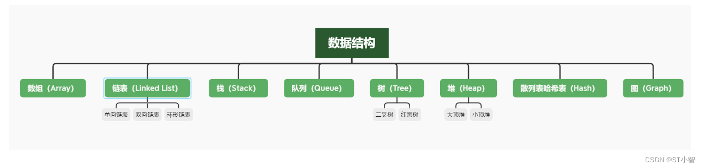

- 嵌入式C语言[[数据结构]]应用
	- [嵌入式C语言九大数据结构操作方式详解](https://blog.csdn.net/weixin_41114301/article/details/129408640)
	- 
	- 常用的数据结构可根据数据访问的特点分为**线性结构**和**非线性结构**。线性结构包括常见的[[数组]]、[[链表]]、[[栈]]、[[队列]]等，非线性结构包括[[树]]、[[图]]等。
	-