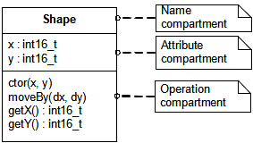
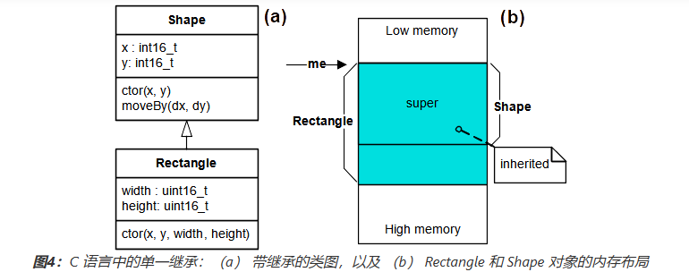

- [[QP框架学习]]
	- **qpc移植**
		- [Blinky实例分析来认识一下QP状态机 (qq.com)](https://mp.weixin.qq.com/s?__biz=MzI5NzM5MjMxNw==&mid=2247495440&idx=1&sn=2f38b7a1bc16fbbc5900ba6b37afc1cb&chksm=ecb76ec2dbc0e7d4b7cf11d65a662585846eeed2e8e0ff6e9c43c78b3fe17e90ce3dcadef60b&mpshare=1&scene=1&srcid=0426t8NHzaghSgkNGIdFrMpN&sharer_shareinfo=5f24019d40722acfdc6c704fdbeea45c&sharer_shareinfo_first=5f24019d40722acfdc6c704fdbeea45c#rd)
			- 不知道大家看到上面解释中的代码有没有疑惑，BSP_ledOn()函数啥都没有啊，难道不应该控制某个gpio口来控制led灯的状态吗？
			- 这里是**专门被设计成了不需要直接访问目标资源，不写入特定的嵌入式主板的GPIO，而是访问调用封装好的BSP，这样就不需要改变它的状态机代码了。**
			- 对于不同的硬件平台，状态机实现代码（blinky.c）是一样的，只需要更改bsp包就行
		- 官网参考手册
			- [QP/C: Overview (state-machine.com)](https://www.state-machine.com/qpc/)
			- [QP/C++: Overview (state-machine.com)](https://www.state-machine.com/qpcpp/)
			- [QM: About QM™ (state-machine.com)](https://www.state-machine.com/qm/)
			- [QTools: Overview (state-machine.com)](https://www.state-machine.com/qtools/)
				- [QTools: QP/Spy™ Software Tracing (state-machine.com)](https://www.state-machine.com/qtools/qpspy.html)
				- [QTools: QUTest™ Unit Testing Harness (state-machine.com)](https://www.state-machine.com/qtools/qutest.html)
				- [QTools: QView™ Visualization & Monitoring (state-machine.com)](https://www.state-machine.com/qtools/qview.html)
				- [QTools: QWin™ GUI Prototyping Toolkit (state-machine.com)](https://www.state-machine.com/qtools/qwin.html)
		- **Application Notes & Articles**
			- [QP/C: ARM Cortex-M (state-machine.com)](https://www.state-machine.com/qpc/arm-cm.html)
			- ==ARM Cortex-M== ports
				- 路径位置
				  collapsed:: true
					- ```
					  qp/ports/arm-cm     // QP ports to ARM Cortex-M
					  +---qk              // ports to QK preemptive kernel
					  |   +---armclang    // ports for ARM-CLANG (LLVM)
					  |   |       qp_port.h   // QP port
					  |   |       qs_port.h   // QS port
					  |   |       qk_port.c   // QK port implementation
					  |   +---gnu         // ports for GNU-ARM
					  |   |       ~ ~ ~
					  |   +---iar         // ports for IAR EWARM
					  |   |       ~ ~ ~
					  +---qv              // ports to QV non-preemptive kernel
					  |   +---armclang    // ports for ARM-CLANG (LLVM)
					  |   |       qp_port.h   // QP port
					  |   |       qs_port.h   // QS port
					  |   |       qv_port.c   // QV port implementation
					  |   +---gnu         // ports for GNU-ARM
					  |   |       ~ ~ ~
					  |   +---iar         // ports for IAR EWARM
					  |   |       ~ ~ ~
					  +---qxk             // ports to QXK dual-mode kernel
					  |   +---armclang    // ports for ARM-CLANG (LLVM)
					  |   |       qp_port.h   // QP port
					  |   |       qs_port.h   // QS port
					  |   |       qxk_port.c  // QXK port implementation
					  |   +---gnu         // ports for GNU-ARM
					  |   |       ~ ~ ~
					  |   +---iar         // ports for IAR EWARM
					  |   |       ~ ~ ~
					  ```
				- 与任何实时内核一样，QP/C 实时框架需要禁用中断才能访问代码的关键部分，并在完成后重新启用中断。
				- 只有“内核感知”中断才能调用 QP/C 服务。“内核无感知”中断**不允许**调用任何 QP/C 服务，它们只能通过触发“内核感知”中断（可以发布或发布事件）来与 QP/C 通信。
				  collapsed:: true
					- STM32 MCU实现4个优先级位（见下图）。CMSIS标准提供宏NVIC_PRIO_BITS，该**宏**指定在给定ARM Cortex-M实现中定义的NVIC优先级位数。
					- 
			- 在嵌入式系统中，除非一切正常，否则什么都不起作用。这意味着您应该始终从一个**工作系统**开始并逐渐发展它，一次更改一件事，并确保它在每一步都保持工作状态。
			- [STM32学习：STM32固件库介绍 - 简书 (jianshu.com)](https://www.jianshu.com/p/4f4b56722e1d)
			  collapsed:: true
				- CMSIS标准的英文全称是Cortex Microcontroller Software Interface Standard，翻译过来就是ARM Cortex微控制器软件接口标准。因为基于Cortex内核的芯片生产厂商有很多，不只是ST公司。为了解决不同厂家生产的Crotex芯片软件兼容问题，ARM公司和其他芯片厂商制定了这个CMSIS标准。
					- 
			- **USART**是一个全双工通用同步/异步串行收发器，该接口是一个高度灵活的串行通信设备。
				- Universal Synchronous/Asynchronous Receiver/Transmitter
	- **qp编程象思想**
		- [qpstudy: QP学习例程，包含博客与例程代码，旨在将众多的QP初学者认识到QP的价值。 (gitee.com)](https://gitee.com/woodman_112/qpstudy)
		- QP颠覆了之前的**前后台**和**RTOS**的思维逻辑。
		- **嵌入式软件不仅是软件工程，更是系统工程**
			- 嵌入式软件，从来都不是纯粹的软件，而是与硬件（PCB、器件、执行机构、传感器、显示部件）等紧密相关。
		- [blog/当单片机遇上状态机 入门QP.md · woodman/qpstudy - 码云 - 开源中国 (gitee.com)](https://gitee.com/woodman_112/qpstudy/blob/master/blog/%E5%BD%93%E5%8D%95%E7%89%87%E6%9C%BA%E9%81%87%E4%B8%8A%E7%8A%B6%E6%80%81%E6%9C%BA%20%E5%85%A5%E9%97%A8QP.md)
		- 在QP中，AO（Active Object）是核心，QP的所有功能都是围绕AO展开的，就好比在RTOS中任务是核心一样。AO之间，纯粹靠事件进行通信，原则上是不允许AO间共享全局变量的。
		- ==发布-订阅模式==的最大好处，就是模块间的彻底解耦。这里插入一个程序设计原则，好的程序，一定是解耦良好的程序。所谓耦合，就是模块A变了，模块B也得跟着变，否则，B模块会运行不正常，模块之间有依赖；所谓解耦，就是去除模块之间的依赖，模块A变了，模块B无须改变。
	- ### 面向对象编程C语言实现
		- 参考
			- [面向对象编程 (state-machine.com)](https://www.state-machine.com/oop)
			- [QuantumLeaps/OOP-in-C: Simple and efficient implementation of OOP in C suitable for real-time embedded systems. (github.com)](https://github.com/QuantumLeaps/OOP-in-C)
			- [基于C语言的面向对象编程 - hyper99 - 博客园 (cnblogs.com)](https://www.cnblogs.com/hyper99/p/ji-yuC-yu-yan-de-mian-xiang-dui-xiang-bian-cheng.html)
		- >什么是面向对象编程？
		  >
		  >面向对象编程 （OOP） 是一种* *基于三个基本概念的设计：
		  >
		  >**封装** – 将数据和函数打包到类中的能力
		  >**继承** – 基于现有类定义新类的能力，以便获得重用和 代码组织
		  >**多态性** – 在运行时将匹配接口的对象相互替换的能力
		- 面向对象是一种思想，与用何种语言实现无关。
		- **1、封装**
		  collapsed:: true
			- C语言用结构体定义数据，定义函数为操作数据的方法。
			- ship.h
				- ```c
				  #ifndef SHAPE_H
				  #define SHAPE_H
				  
				  #include <stdint.h>
				  
				    
				    
				  /* 定义Shape类的属性（数据） */
				  typedef struct {
				      int16_t x; /* x-coordinate of Shape's position */
				      int16_t y; /* y-coordinate of Shape's position */
				    
				  } Shape;
				  
				  /* 定义操作Shape类的方法（函数接口）*/
				  void Shape_ctor(Shape * const me, int16_t x, int16_t y);
				  void Shape_moveBy(Shape * const me, int16_t dx, int16_t dy);
				  int16_t Shape_getX(Shape const * const me);
				  int16_t Shape_getY(Shape const * const me);
				    
				  #endif /* SHAPE_H */
				  ```
				- 
				-
			- shape.c
				- ```c
				  #include "shape.h" /* Shape类的接口*/
				  
				  /* constructor implementation */
				  void Shape_ctor(Shape * const me, int16_t x, int16_t y) {
				      me->x = x;
				      me->y = y;
				  }
				  
				  /* move-by operation implementation */
				  void Shape_moveBy(Shape * const me, int16_t dx, int16_t dy) {
				      me->x += dx;
				      me->y += dy;
				  }
				  
				  /* "getter" operations implementation */
				  int16_t Shape_getX(Shape const * const me) {
				      return me->x;
				  }
				  int16_t Shape_getY(Shape const * const me) {
				      return me->y;
				  }
				  ```
				- ★★★结构体指针作为函数第一个参数，能够对数据进行修改（输入/输出）。嵌入式应用中，可以更加结构化的定义数据为**输入、输出和参数**三种类型。
					- ```c
					  //function.h
					  #ifndef FUNCTION_H
					  #define FUNCTION_H
					  
					  #ifdef __cplusplus
					  extern "C"
					  {
					  #endif
					    
					  #define IN(X) ((me->in.x))
					  #define PARM(X) ((me->parm.x))
					  #define OUT(X) ((me->out.x))
					  
					  /* 定义FUNCTION类的属性（数据） */
					  typedef struct {
					    struct
					    {
					      int16_t *data_x; 
					      int16_t *data_y; 
					    }in;
					    struct
					    {
					      uint8_t parm_times;
					    }parm;
					     struct
					    {
					      uint16_t result;
					    }out;  
					  } FUNCTION;
					  
					  //定义FUNCTION类的接口
					  void run(FUNCTION *me);
					  
					  #ifdef __cplusplus
					  }
					  #endif  
					  #endif /* FUNCTION_H */
					  ```
				- 访问数据可通过如下方式
					- ```c
					  #include "function.h"
					  
					  FUNCTION g_function;
					  FUNCTION *g_pFunction = &g_function;
					  
					  void run((FUNCTION *me)
					  {
					  	OUT(result) = *IN(data_x) +  *IN(data_y) * PARM(parm_times);
					  	return; 
					  }
					  ```
					- 不带返回值的return语句用于，中断返回值为void类型的函数的执行，而带返回值的return则不行。
		- **2、继承**
		  collapsed:: true
			- 继承是基于现有类定义新类的能力，以便==**重用和组织代码**==。通过将继承的类属性结构嵌入为派生类属性结构==**的第一个**成员==，可以轻松地在 C 语言中实现==单一继承==。
			- rect.h
				- ```c
				  #ifndef RECT_H
				  #define RECT_H
				  
				  #include "shape.h" 
				  
				  typedef struct {
				      Shape super; /* 继承 Shape 类*/
				  
				      /* 子类的属性*/
				      uint16_t width;
				      uint16_t height;
				  } Rectangle;
				  
				  /* 构造函数原型 */
				  void Rectangle_ctor(Rectangle * const me, int16_t x, int16_t y,
				                      uint16_t width, uint16_t height);
				  
				  #endif /* RECT_H */
				  ```
			- rect.c
				- ```c
				  #include "rect.h"
				  
				  void Rectangle_ctor(Rectangle * const me, int16_t x, int16_t y,
				                      uint16_t width, uint16_t height)
				  {
				      Shape_ctor(&me->super, x, y);
				  
				      me->width = width;
				      me->height = height;
				  }
				  ```
			- 
			- main.c
				- ```c
				  #include "rect.h"  /* Rectangle class interface */
				  #include <stdio.h>  /* for printf() */
				  
				  int main() {
				      Rectangle r1, r2; /* multiple instances of Rect */
				  
				      /* instantiate rectangles... */
				      Rectangle_ctor(&r1, 0, 2, 10, 15);
				      Rectangle_ctor(&r2, -1, 3, 5, 8);
				  
				      printf("Rect r1(x=%d,y=%d,width=%d,height=%d)\n",
				             Shape_getX(&r1.super), Shape_getY(&r1.super),
				             r1.width, r1.height);
				      printf("Rect r2(x=%d,y=%d,width=%d,height=%d)\n",
				             Shape_getX(&r2.super), Shape_getY(&r2.super),
				             r2.width, r2.height);
				  
				      /* re-use inherited function from the superclass Shape... */
				      Shape_moveBy((Shape *)&r1, -2, 3);
				      Shape_moveBy(&r2.super, 2, -1);
				  
				      printf("Rect r1(x=%d,y=%d,width=%d,height=%d)\n",
				             Shape_getX(&r1.super), Shape_getY(&r1.super),
				             r1.width, r1.height);
				      printf("Rect r2(x=%d,y=%d,width=%d,height=%d)\n",
				             Shape_getX(&r2.super), Shape_getY(&r2.super),
				             r2.width, r2.height);
				  
				      return 0;
				  }
				  ```
				-
		- **3、多态**
		  collapsed:: true
			- 多态性是在运行时将匹配接口的对象相互替换的能力。C++ 使用虚函数实现多态性。
			- shape.h
			  collapsed:: true
				- ```c
				  #ifndef SHAPE_H
				  #define SHAPE_H
				  
				  #include <stdint.h>
				  
				  /* Shape's attributes... */
				  struct ShapeVtbl; /* forward declaration */
				  typedef struct {
				      struct ShapeVtbl const *vptr; /* <== Shape's Virtual Pointer */
				      int16_t x; /* x-coordinate of Shape's position */
				      int16_t y; /* y-coordinate of Shape's position */
				  } Shape;
				  
				  /* Shape's virtual table */
				  struct ShapeVtbl {
				      uint32_t (*area)(Shape const * const me);
				      void (*draw)(Shape const * const me);
				  };
				  
				  /* Shape's operations (Shape's interface)... */
				  void Shape_ctor(Shape * const me, int16_t x, int16_t y);
				  void Shape_moveBy(Shape * const me, int16_t dx, int16_t dy);
				  int16_t Shape_getX(Shape const * const me);
				  int16_t Shape_getY(Shape const * const me);
				  
				  static inline uint32_t Shape_area(Shape const * const me) {
				      return (*me->vptr->area)(me);
				  }
				  
				  static inline void Shape_draw(Shape const * const me) {
				      (*me->vptr->draw)(me);
				  }
				  
				  /* generic operations on collections of Shapes */
				  Shape const *largestShape(Shape const *shapes[], uint32_t nShapes);
				  void drawAllShapes(Shape const *shapes[], uint32_t nShapes);
				  
				  #endif /* SHAPE_H */
				  
				  ```
			- shape.c
			  collapsed:: true
				- ```c
				  #include "shape.h"
				  #include <assert.h>
				  
				  /* Shape's prototypes of its virtual functions */
				  static uint32_t Shape_area_(Shape const * const me);
				  static void Shape_draw_(Shape const * const me);
				  
				  /* constructor */
				  void Shape_ctor(Shape * const me, int16_t x, int16_t y) {
				      static struct ShapeVtbl const vtbl = { /* vtbl of the Shape class */
				          &Shape_area_,
				          &Shape_draw_
				       };
				       me->vptr = &vtbl; /* "hook" the vptr to the vtbl */
				       me->x = x;
				       me->y = y;
				  }
				  
				  /* move-by operation */
				  void Shape_moveBy(Shape * const me, int16_t dx, int16_t dy) {
				      me->x += dx;
				      me->y += dy;
				  }
				  
				  /* "getter" operations implementation */
				  int16_t Shape_getX(Shape const * const me) {
				      return me->x;
				  }
				  int16_t Shape_getY(Shape const * const me) {
				      return me->y;
				  }
				  
				  /* Shape class implementations of its virtual functions... */
				  static uint32_t Shape_area_(Shape const * const me) {
				      assert(0); /* purely-virtual function should never be called */
				      return 0U; /* to avoid compiler warnings */
				  }
				  
				  static void Shape_draw_(Shape const * const me) {
				      assert(0); /* purely-virtual function should never be called */
				  }
				  
				  /* the following code finds the largest-area shape in the collection */
				  Shape const *largestShape(Shape const *shapes[], uint32_t nShapes) {
				      Shape const *s = (Shape *)0;
				      uint32_t max = 0U;
				      uint32_t i;
				      for (i = 0U; i < nShapes; ++i) {
				          uint32_t area = Shape_area(shapes[i]); /* virtual call */
				          if (area > max) {
				              max = area;
				              s = shapes[i];
				          }
				      }
				      return s; /* the largest shape in the array shapes[] */
				  }
				  
				  /* The following code will draw all Shapes on the screen */
				  void drawAllShapes(Shape const *shapes[], uint32_t nShapes) {
				      uint32_t i;
				      for (i = 0U; i < nShapes; ++i) {
				          Shape_draw(shapes[i]); /* virtual call */
				      }
				  }
				  ```
			- rect.h
			  collapsed:: true
				- ```c
				  #ifndef RECT_H
				  #define RECT_H
				  
				  #include "shape.h" /* the base class interface */
				  
				  /* Rectangle's attributes... */
				  typedef struct {
				      Shape super; /* <== inherits Shape */
				  
				      /* attributes added by this subclass... */
				      uint16_t width;
				      uint16_t height;
				  } Rectangle;
				  
				  /* constructor prototype */
				  void Rectangle_ctor(Rectangle * const me, int16_t x, int16_t y,
				                      uint16_t width, uint16_t height);
				  
				  #endif /* RECT_H */
				  
				  ```
				-
			- rect.c
			  collapsed:: true
				- ```c
				  #include "rect.h"  /* Rectangle class interface */
				  #include <stdio.h> /* for printf() */
				  
				  /* Rectangle's prototypes of its virtual functions */
				  /* NOTE: the "me" pointer has the type of the superclass to fit the vtable */
				  static uint32_t Rectangle_area_(Shape const * const me);
				  static void Rectangle_draw_(Shape const * const me);
				  
				  /* constructor */
				  void Rectangle_ctor(Rectangle * const me, int16_t x, int16_t y,
				                      uint16_t width, uint16_t height)
				  {
				      static struct ShapeVtbl const vtbl = { /* vtbl of the Rectangle class */
				          &Rectangle_area_,
				          &Rectangle_draw_
				      };
				      Shape_ctor(&me->super, x, y); /* call the superclass' ctor */
				      me->super.vptr = &vtbl; /* override the vptr */
				      me->width = width;
				      me->height = height;
				  }
				  
				  /* Rectangle's class implementations of its virtual functions... */
				  static uint32_t Rectangle_area_(Shape const * const me) {
				      Rectangle const * const me_ = (Rectangle const *)me; /* explicit downcast */
				      return (uint32_t)me_->width * (uint32_t)me_->height;
				  }
				  
				  static void Rectangle_draw_(Shape const * const me) {
				      Rectangle const * const me_ = (Rectangle const *)me; /* explicit downcast */
				      printf("Rectangle_draw_(x=%d,y=%d,width=%d,height=%d)\n",
				             Shape_getX(me), Shape_getY(me), me_->width, me_->height);
				  }
				  
				  ```
			- circle.h
			  collapsed:: true
				- ```c
				  #ifndef CIRCLE_H
				  #define CIRCLE_H
				  
				  #include "shape.h" /* the base class interface */
				  
				  typedef struct {
				      Shape super; /* <== inherits Shape */
				  
				      /* attributes added by this subclass... */
				      uint16_t rad;
				  } Circle;
				  
				  /* constructor */
				  void Circle_ctor(Circle * const me, int16_t x, int16_t y,
				                   uint16_t rad);
				  
				  #endif /* CIRCLE_H */
				  
				  ```
			- circle.c
			  collapsed:: true
				- ```c
				  #include "circle.h"  /* Circle class interface */
				  #include <stdio.h> /* for printf() */
				  
				  /* NOTE: the "me" pointer has the type of the superclass to fit the vtable */
				  static uint32_t Circle_area_(Shape const * const me);
				  static void Circle_draw_(Shape const * const me);
				  
				  /* constructor */
				  void Circle_ctor(Circle * const me, int16_t x, int16_t y,
				                   uint16_t rad)
				  {
				      static struct ShapeVtbl const vtbl = { /* vtbl of the Circle class */
				          &Circle_area_,
				          &Circle_draw_
				      };
				      Shape_ctor(&me->super, x, y); /* call the superclass' ctor */
				      me->super.vptr = &vtbl; /* override the vptr */
				      me->rad = rad;
				  }
				  
				  /* Circle's class implementations of its virtual functions... */
				  static uint32_t Circle_area_(Shape const * const me) {
				      Circle const * const me_ = (Circle const *)me; /* explicit downcast */
				      /* pi is approximated as 3 */
				      return 3U * (uint32_t)me_->rad * (uint32_t)me_->rad;
				  }
				  
				  static void Circle_draw_(Shape const * const me) {
				      Circle const * const me_ = (Circle const *)me; /* explicit downcast */
				      printf("Circle_draw_(x=%d,y=%d,rad=%d)\n",
				             Shape_getX(me), Shape_getY(me), me_->rad);
				  }
				  ```
			- main.c
			  collapsed:: true
				- ```c
				  #include "rect.h"   /* Rectangle class interface */
				  #include "circle.h" /* Circle class interface */
				  #include <stdio.h>  /* for printf() */
				  
				  int main() {
				      Rectangle r1, r2; /* multiple instances of Rectangle */
				      Circle    c1, c2; /* multiple instances of Circle */
				      Shape const *shapes[] = { /* collection of shapes */
				          &c1.super,
				          &r2.super,
				          &c2.super,
				          &r1.super
				      };
				      Shape const *s;
				  
				      /* instantiate rectangles... */
				      Rectangle_ctor(&r1, 0, 2, 10, 15);
				      Rectangle_ctor(&r2, -1, 3, 5, 8);
				  
				      /* instantiate circles... */
				      Circle_ctor(&c1, 1, -2, 12);
				      Circle_ctor(&c2, 1, -3, 6);
				  
				      s = largestShape(shapes, sizeof(shapes)/sizeof(shapes[0]));
				      printf("largetsShape s(x=%d,y=%d)\n",
				             Shape_getX(s), Shape_getY(s));
				  
				      drawAllShapes(shapes, sizeof(shapes)/sizeof(shapes[0]));
				  
				      return 0;
				  }
				  ```
		- **事实证明，多态性非常复杂，如果打算广泛使用,切换到 C++ 可能会更好。但如果构建或使用库，则 C 语言中 OOP 的复杂性可以限制在库中，并且可以有效地隐藏在应用程序开发人员面前。**