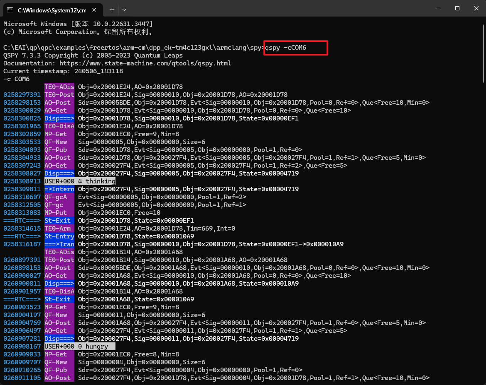

- [[QP框架学习]]
	- 开发环境：
		- 目标硬件：德州仪器TI，EK-TM4C123GXL
		- 开发平台：vscode+makefile 编译+LMFlash 烧写
			- 备选：keil IDE / CCS IDE (调试功能强大)
		- 中间件：使用[QP real-time embedded frameworks (RTEFs)](https://www.state-machine.com/products/qp)、[FreeRTOS](https://www.freertos.org/zh-cn-cmn-s/)
	- freertos例子使用qspy
		- 串口打印输出可读字符串数据
			- 命令行 `qspy -c COM6`
			- 
		- qspy原理及其使用
		  :LOGBOOK:
		  CLOCK: [2024-08-23 Fri 21:05:03]
		  :END:
	- {{embed ((6625fce7-b147-444e-8365-e9d552a7719c))}}
	- [[qp]]框架理解
		- ⭐⭐ [嵌入式状态机编程-QP状态机框架与常见状态机方法](https://blog.csdn.net/qq_36969440/article/details/110387716)
		- [Modern Embedded Software - Quantum Leaps (QP官网)](https://www.state-machine.com/)
		- [嵌入式开发绝招：状态机+事件驱动框架~ - 知乎 (zhihu.com)](https://zhuanlan.zhihu.com/p/642732486)
		- **事件驱动型系统**
			- 区别传统嵌入式开发中的**轮询系统**、**前后台系统**和**多任务系统**，**事件驱动架构**是一种软件设计模式，以 {{cloze 事件}}为中心，通过 {{cloze 事件的触发和处理}}来实现系统的实时和响应式。在这种架构下，系统的各个组件通过事件进行通信和协调，而不是直接调用彼此的方法。这种架构能够提供高效的**系统扩展性、可靠性和可维护性**。
			  card-last-interval:: -1
			  card-repeats:: 1
			  card-ease-factor:: 2.5
			  card-next-schedule:: 2024-07-14T16:00:00.000Z
			  card-last-reviewed:: 2024-07-14T14:12:19.471Z
			  card-last-score:: 1
				- 《深入理解与实现 RTOS》
				- ==**轮询系统**==：主程序是一段无限循环的代码，在循环中顺序查询各 个条件，如果满足就执行相应的操作。
				- ==**前后台系统**== ：相对轮询系统，前后台系统对外部事件的处理做了优化。前后台系统是由中断驱动的。主程序依然是一段无限循环的代码，称为后台程序，而事件的响应则由中断来完成， 称为前台程序。在后台程序执行的时候，如果有外部事件发生，则前台的中断程序会打 断后台程序。在完成必要的事件响应之后，前台中断程序退出并通知后台程序来继续操 作。由后台程序完成事件的后继处理，比如数据的分析等操作。从代码功能上讲，事件 的响应和处理分为了两个部分。因为中断自身有优先级和嵌套的功能，所以优先级高的 事件能够得到及时响应。但后台程序仍然需要按顺序的处理各个事件的后继事务。
				- ==**多任务系统**==：和前后台系统相比，多任务系统在响应事件的时候，同样是由多个中断处理程序完 成的。但是对于事件的后继操作则是由多个任务来处理的。也就是说每个任务处理它所 负责的事件。在基于优先级的多任务系统中，因为任务间优先级的关系，那么优先级高 的任务可得到优先处理。这样优先级高的事件就能及时得到处理；在基于分时机制的多 任务系统中，则任务间按比例轮流占用处理器。