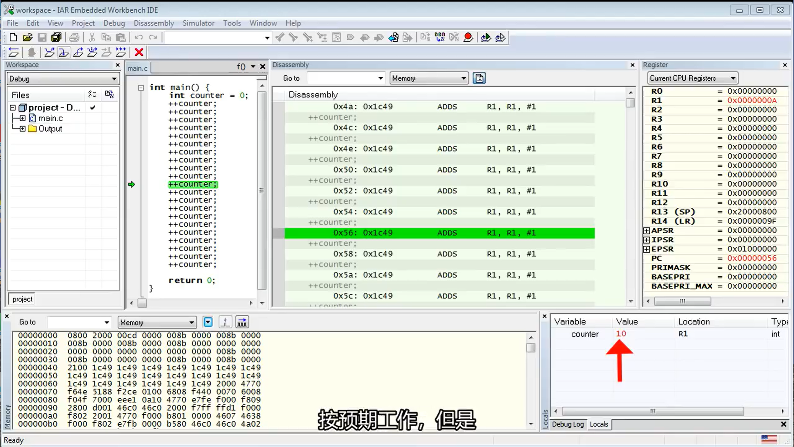

- **计算机如何计数？**
	- [计算机是如何计数的_现代嵌入式编程_QuantumLeap](https://www.bilibili.com/video/BV1754y1w7NB?vd_source=45fd533064b8c241036e73ec2339b6dc)
	- 有助于理解计算机底层运行原理
	- 开发板
		- main.c
		  collapsed:: true
			- ```c
			  int main()
			  {
			    int counter = 0;
			    ++counter;
			    ++counter;
			    ++counter;
			    ++counter;
			    ++counter;
			    ++counter;
			    
			    return 0;
			  }
			  ```
		- 