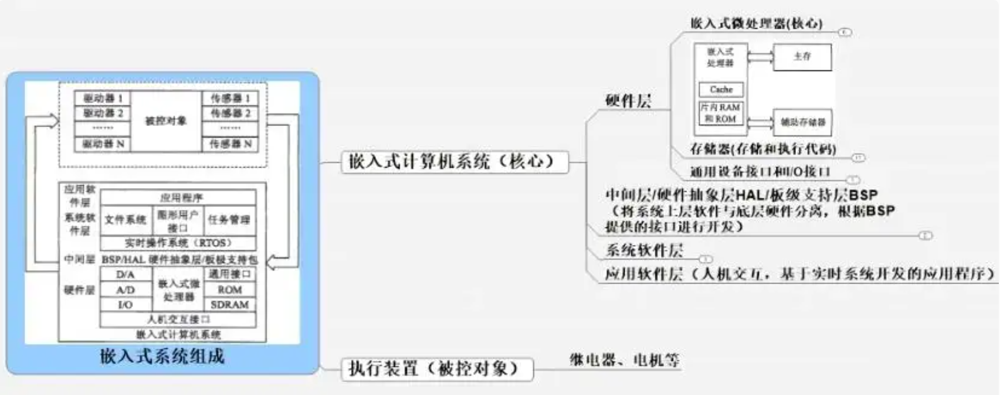

- 嵌入式系统
	- 一般结构
		- 
	- 采样率
		- [采样率是什么意思? 为什么采样率是示波器的关键技术指标之一？ - 知乎 (zhihu.com)](https://zhuanlan.zhihu.com/p/637481168)
		- 采样率过低不仅会导致失真，还会使您错过没有采样到的关键信号细节，如毛刺和误差。
		- ***Nyquist采样定理***  对于具有最大频率 fMAX 的有限带宽信号，等间隔采样频率 fS 必须大于两倍的最大频率 fMAX，才能唯一地重建信号而不会有混叠现象。
	- 静态局部变量
		- **静态局部变量**只在定义它的函数内有效，且程序仅分配一次内存，函数返回后，该变量不会消失
	- C/C++后端开发环境
		- vscode
			- C/C++相关插件
			- Cmake相关插件
		- mingw64
			- [Releases · niXman/mingw-builds-binaries (github.com)](https://github.com/niXman/mingw-builds-binaries/releases)
			- https://github.com/niXman/mingw-builds-binaries/releases/download/13.2.0-rt_v11-rev1/x86_64-13.2.0-release-posix-seh-ucrt-rt_v11-rev1.7z
		- cmake
			- [Getting Started with CMake](https://cmake.org/getting-started/)
			- https://github.com/Kitware/CMake/releases/download/v3.29.0/cmake-3.29.0-windows-x86_64.zip
		- cmake、mingw64解压后放在vscdoe安装目录
	- PC-lint 静态代码检测
	- [[MQTT]]
		- [【MQTT】MQTT简介+安装+使用-CSDN博客](https://blog.csdn.net/bandaoyu/article/details/104311367)
	- 应用程序从烧写进目标机到运行的过程是什么？
	-
-
- [[python]]
	- 武装飞船项目
		- 冻结代码时包含图片文件，如何操作？
		- 最佳项目组织结构？
			- [Python最佳实践指南！ — The Hitchhiker's Guide to Python (codingdict.com)](https://doc.codingdict.com/python-guide-cn/index.html)
		- 开发流程
	- Python函数后面的箭头
	  collapsed:: true
		- tags:: python
		- ```python
		  def  hello(greet : str, flag : bool) -> int:
		       print("hello", greet)
		  print(hello**.**__annotations__)  #输出函数hello的属性
		  #输出{'greet': <class 'str'>, 'flag': <class 'bool'>, 'return': <class 'int'>}
		  
		  def **hello**(greet:"hello", flag:"world") **->** "helloworld":
		    print("hello", greet)
		    **return** print(greet)
		  print(hello**.**__annotations__)
		  *#输出{'greet': 'hello', 'flag': 'world', 'return': 'helloworld'}*
		  ```
		- Python函数后面的箭头一般用在函数后面，用来注释返回值是个什么东西
		- **函数注释包括：**
		  参数注释：以冒号（:）标记
		  返回值注释：以 -> 标记
		- 用一句话hello.__annotations__就得到了hello函数属性的类型。
		- **需要注意，注解对Python解释器没任何意义，python对不做检查，不做强制，不做验证！什么都不做。所以注释后面即使是一段话（字符串）也OK！**
	- **ACM模式处理输入输出**
		- collapsed:: true
		  1. 多⾏输⼊，每⾏两个整数
			- A+B 问题
			- [1. A+B问题I (kamacoder.com)](https://kamacoder.com/problempage.php?pid=1000)
			- ```python
			  import sys
			  # 接受输入
			  for line in sys.stdin:
			    a, b = line.split(" ")
			    # 输出
			    print(int(a) + int(b))
			    # 输出换行
			    print()
			  ```
			- ```c++
			  #include <iostream>
			  using namespace std;
			  int main()
			  {
			    int a,b;
			    while(cin >> a >> b) cout << a + b << endl;
			  }
			  ```
		- collapsed:: true
		  2. 多组数据，每组第⼀⾏为n, 之后输⼊n⾏两个整数
			- [2. A+B问题II (kamacoder.com)](https://kamacoder.com/problempage.php?pid=1001)
			- ```python
			  while 1:
			    try:
			      N = int(input())
			      for i in range(N):
			        l = list(map(int, input().split()))
			        print(sum(l))
			    except:
			      break
			  ```
			- ```c++
			  #include <iostream>
			  using namespace std;
			  int main()
			  {
			    int n,a,b;
			    while (cin >> n)
			    {
			      while (n--)
			      {
			        cin >> a >> b;
			        cout << a+b << endl;
			      }
			    }
			  }
			  ```
		- collapsed:: true
		  3. 若⼲⾏输⼊，每⾏输⼊两个整数，遇到特定条件终⽌
			- [3. A+B问题III (kamacoder.com)](https://kamacoder.com/problempage.php?pid=1002)
			- ```python
			  import sys
			  
			  while True:
			    s = input().split()
			    a, b = int(s[0]), int(s[1])
			    if not a or not b:
			      break
			    print(a+b)
			  ```
			- ```c++
			  #include <iostream>
			  using namespace std;
			  int main()
			  {
			    int a,b;
			    while(cin>> a >> b)
			    {
			      if (a ++0 && b == 0)
			        cout<< a+b <<endl;
			    }
			  }
			  ```
		- collapsed:: true
		  4. 若⼲⾏输⼊，遇到0终⽌，每⾏第⼀个数为N，表示本⾏后⾯有N个数
			- ```python
			  import sys 
			  
			  for line in sys.stdin:
			    nums = line.split()
			    nums = list(map(int, nums))
			    n = nums[0]
			    if not n:
			      break
			    print(sum(nums[-n:]))
			  ```
			- ```c++
			  #include <iostream>
			  using name space;
			  int main()
			  {
			    int n,a;
			    while(cin>>n)
			    {
			      if(n ==0 ) break;
			      int sum =0;
			      while(n--)
			      {
			        cin>>a;
			        sum += a;
			      }
			      cout<< sum << endl;
			    }
			  }
			  ```
		- collapsed:: true
		  5. 若⼲⾏输⼊，每⾏包括两个整数a和b，由空格分隔，每⾏输出后接⼀个空⾏。
			- ```python
			  while True:
			  	try:
			  		x, y = map(int, (input().split()))
			  		print(x + y)
			  		print()
			  	except:
			  		break
			  ```
			- ```c++
			  #include<iostream>
			  using namespace std;
			  int main() 
			  {
			  	int a, b;
			  	while (cin >> a >> b) cout << a + b << endl << endl;
			  }
			  ```
		- collapsed:: true
		  6. 多组n⾏数据，每⾏先输⼊⼀个整数N，然后在同⼀⾏内输⼊M个整数,每组输出之间输出⼀个空⾏。
			- ```python
			  while 1:
			    try:
			      N = int(int())
			      for i in range(N):
			        n = list(map(int, input.split()))
			        if n[0] ==0:
			          print()
			          continue
			        print(sum(n[1:]))
			        if o< N-1:
			          print()
			    except:
			      break
			      
			  ```
			- ```c++
			  #include<iostream>
			  using namespace std;
			  int main() 
			  {
			  	int n, m, a;
			  	// 输⼊多组数据
			  	while (cin >> n) 
			      {
			  	// 每组数据有n⾏
			  		while(n--) 
			          {
			  			cin >> m;
			  			int sum = 0;
			  			// 每⾏有m个
			  			while(m--) 
			              {
			  				cin >> a;
			                  sum += a;
			  			}
			  			cout << sum << endl;
			  			cout << endl;
			  		}
			  	}
			  }
			  ```
		- collapsed:: true
		  7. 多组测试样例，每组输⼊数据为字符串，字符⽤空格分隔,输出为⼩数点后两位
			- ```python
			  while 1:
			  	try:
			  		n = input().replace(" ", "").replace("A", "4").replace("B", "3").replace("C", "2").replace("D", "1").replace("F", "0")
			  		s = 0
			  		for i in n:
			  			if i not in '43210':
			  			print('Unknown')
			  			break
			          s += int(i)
			  	else:
			  		print(f"{s / len(n):.2f}")
			  		except:
			  		break    
			  ```
			- ```c++
			  #include <iostream>
			  using namespace std;
			  int main() 
			  {
			  	string s;
			  	while (getline(cin, s)) 
			      { // 接受⼀整⾏字符串
			  		for(int i = 0; i < s.size(); i++) 
			      	{ // 遍历字符串
			  		}
			  	}
			  }
			  ```
			- ```c++
			  #include <iostream>
			  #include <stdio.h>
			  int main() 
			  {
			  	float sum = 10.0;
			  	int count = 4;
			  	printf("%.2f\n", sum / count);
			  }
			  ```
	- python学习牛客网
		- [python3教程_编程入门教程_牛客网 (nowcoder.com)](https://www.nowcoder.com/tutorial/10005/2ab560bdd36f46f09bcdefcd51ad5333)
		- 复数表示
		  collapsed:: true
			- 2+4j
		- 字符串切片
		  collapsed:: true
			- 变量[头下标:尾下标:步长]
			- 索引值以 0 为开始值，-1 为从末尾的开始位置。左闭右开。
			- 步长为负数，表示逆向读取
			  collapsed:: true
				- ```python
				  def reverseWords(input):
				  
				      # 通过空格将字符串分隔符，把各个单词分隔为列表
				      inputWords = input.split(" ")
				  
				      # 翻转字符串
				      # 假设列表 list = [1,2,3,4],  
				      # list[0]=1, list[1]=2 ，而 -1 表示最后一个元素 list[-1]=4 ( 与 list[3]=4 一样)
				      # inputWords[-1::-1] 有三个参数
				      # 第一个参数 -1 表示最后一个元素
				      # 第二个参数为空，表示移动到列表末尾
				      # 第三个参数为步长，-1 表示逆向
				      inputWords=inputWords[-1::-1]
				  
				      # 重新组合字符串
				      output = ' '.join(inputWords)
				  
				      return output
				  
				  if __name__ == "__main__":
				      input = 'I like nowcoder'
				      rw = reverseWords(input)
				      print(rw)
				  ```
		- 创建空集合
		  collapsed:: true
			- ```python
			  a= set()
			  ```
		- 创建空字典
		  collapsed:: true
			- ```python
			  a = {}
			  ```
		- 算数运算
		  collapsed:: true
			- | % | 取模 - 返回除法的余数 | b % a 输出结果 1 |
			  | ** | 幂 - 返回x的y次幂 | a**b 为10的21次方 |
			  | // | [[$red]]==取整除 - 向下取接近除数的整数== | 9//2输出结果4，-9//2输出结果-5。 |
		- 比较运算符
		  collapsed:: true
			- | 运算符 | 描述 | 实例 |
			  | ---- | ---- | ---- |
			  | == | 等于 - 比较对象是否相等 | (a == b) 返回 False。 |
			  | != | 不等于 - 比较两个对象是否不相等 | (a != b) 返回 True。 |
			  | > | 大于 - 返回x是否大于y | (a > b) 返回 False。 |
			  | < | 小于 - 返回x是否小于y。所有比较运算符返回1表示真，返回0表示假。这分别与特殊的变量True和False等价。注意，这些变量名的大写。 | (a < b) 返回 True。 |
			  | >= | 大于等于 - 返回x是否大于等于y。 | (a >= b) 返回 False。 |
			  | <= | 小于等于 - 返回x是否小于等于y。 | (a <= b) 返回 True。 |
		- ==位运算==
		  collapsed:: true
			- | 运算符 | 描述 | 实例 |
			  | ---- | ---- | ---- |
			  | &  | 按位与运算符：参与运算的两个值,如果两个相应位都为1,则该位的结果为1,否则为0 | (a & b) 输出结果 12 ，二进制解释： 0000 1100 |
			  |  `\`| 按位或运算符：只要对应的二个二进位有一个为1时，结果位就为1。 | (a `\`b) 输出结果 61 ，二进制解释： 0011 1101 |
			  | ^ | 按位异或运算符：当两对应的二进位相异时，结果为1 | (a ^ b) 输出结果 49 ，二进制解释： 0011 0001 |
			  | ~ | 按位取反运算符：对数据的每个二进制位取反,即把1变为0,把0变为1。**~x** 类似于 **-x-1** | (~a ) 输出结果 -61 ，二进制解释： 1100 0011， 在一个有符号二进制数的补码形式。 |
			  | << | 左移动运算符：运算数的各二进位全部左移若干位，由"<<"右边的数指定移动的位数，高位丢弃，低位补0。 | a << 2 输出结果 240 ，二进制解释： 1111 0000 |
			  | >> | 右移动运算符：把">>"左边的运算数的各二进位全部右移若干位，">>"右边的数指定移动的位数 | a >> 2 输出结果 15 ，二进制解释： 0000 1111 |
		- 逻辑运算符
		  collapsed:: true
			- | 运算符 | 逻辑表达式 | 描述 | 实例 |
			  | ---- | ---- | ---- |
			  | and | x and y | 布尔"与" - 如果 x 为 False，x and y 返回 False，否则它返回 y 的计算值。 | (a and b) 返回 20。 |
			  | or | x or y | 布尔"或" - 如果 x 是 True，它返回 x 的值，否则它返回 y 的计算值。 | (a or b) 返回 10。 |
			  | not | not x | 布尔"非" - 如果 x 为 True，返回 False 。如果 x 为 False，它返回 True。 | not(a and b) 返回 False |
		- 成员运算符
		  collapsed:: true
			- 测试实例中包含了一系列的成员
			- | 运算符 | 描述 | 实例 |
			  | ---- | ---- | ---- |
			  | in | 如果在指定的序列中找到值返回 True，否则返回 False。 | x 在 y 序列中 , 如果 x 在 y 序列中返回 True。 |
			  | not in | 如果在指定的序列中没有找到值返回 True，否则返回 False。 | x 不在 y 序列中 , 如果 x 不在 y 序列中返回 True。 |
		- 身份运算符
		  collapsed:: true
			- 身份运算符用于比较两个对象的存储单元
			- | 运算符 | 描述 | 实例 |
			  | ---- | ---- | ---- |
			  | is | is 是判断两个标识符是不是引用自一个对象 | **x is y**, 类似 **id(x) == id(y)** , 如果引用的是同一个对象则返回 True，否则返回 False |
			  | is not | is not 是判断两个标识符是不是引用自不同对象 | **x is not y** ， 类似 **id(a) != id(b)**。如果引用的不是同一个对象则返回结果 True，否则返回 False。 |
		- **is 与 == 区别：**is 用于判断两个变量引用对象是否为同一个， == 用于判断引用变量的值是否相等
	- 语言基础可参考牛客网
		- [python3教程_编程入门教程_牛客网 (nowcoder.com)](https://www.nowcoder.com/tutorial/10005/0358ac597ebd4cceb88e68c58fc6e8a5)
		- [C语言教程_编程入门教程_牛客网 (nowcoder.com)](https://www.nowcoder.com/tutorial/10002/8f7c3e0e7efd441d8f7c9c8d43c2a0f4)
	- [[poetry]] 环境安装
		- [Introduction | Documentation | Poetry - Python dependency management and packaging made easy (python-poetry.org)](https://python-poetry.org/docs/#installing-with-the-official-installer)
		- **Windows (Powershell)**
			- ```
			  (Invoke-WebRequest -Uri https://install.python-poetry.org -UseBasicParsing).Content | py -
			  ```
		- poetry.exe 路径加入到环境变量
			- 并删除上级目录python缓存
		- 验证安装
			- poetry --version
		-
-
- **基于模型的设计方法**
	- 参考教程
		- [Quantum LeaPs（QP）介绍-CSDN博客](https://blog.csdn.net/jin787730090/article/details/119643403)
		- [QP是什么，为什么在国内不为我们所熟悉？ - 知乎 (zhihu.com)](https://zhuanlan.zhihu.com/p/367610067)
	- 移植经验贴
		- [QP状态机学习③——STM32F4移植QP状态机Keil环境_stm32 qp-CSDN博客](https://blog.csdn.net/qq_37214666/article/details/125513347)
		- [树莓派pico移植QP/C状态机架构-CSDN博客](https://blog.csdn.net/weixin_39253446/article/details/136605595)