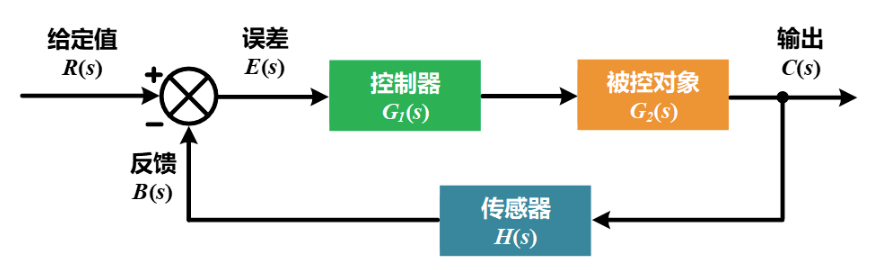

- [[Buck]]电路的传递函数
	- 电源里的扰动基本上是输入和负载的变化，而为了减小扰动对输出电压的影响，我们需要引入反馈的环节，来进行闭环控制。
	- 
	- 开环传递函数
		- $$\frac{B(s) }{E(s)}= G(s)H(s)$$
		- $$\frac{C(s)}{R(s)}= \frac{G(s)}{1+G(s)H(s)}$$
	- 闭环传递函数的分母表达式称为系统的特征式，令该特征式为0，即可得到该系统的特征方程，特征方程的解即为系统闭环传递函数的极点，反映了该闭环控制系统的本质特征，而由特征方程表达式可以看出，闭环系统稳定性实则与系统开环传递函数息息相关。因此我们需要探究系统的开环传递函数。

