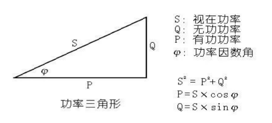
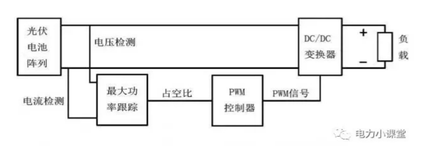

- 视在功率、有功功率和无功功率的理解与计算
	- [如何理解视在功率，有功功率和无功功率？-电子工程专辑](https://www.eet-china.com/mp/a98603.html)
	- 
-
- 什么是MPPT？为什么需要MPPT？
	- [光伏逆变器MPPT的作用、原理及算法_mppt算法编程-CSDN博客](https://blog.csdn.net/lyd0813/article/details/135275457)
	- 