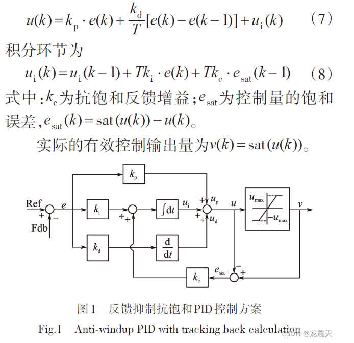

- [[PID]]数字实现
	- [PID控制器的数字实现及C语法讲解 - free_稀饭 - 博客园](https://www.cnblogs.com/cjq0301/p/5184808.html)
	- [【自动驾驶】PID实现轨迹跟踪 | python实现 | C++实现_pid轨迹跟踪-CSDN博客](https://blog.csdn.net/weixin_42301220/article/details/124793474)
	- [积分控制器的优化，应对积分饱和问题_哔哩哔哩_bilibili](https://www.bilibili.com/video/BV1ix4y1R7tr?vd_source=f92eb336806a7a264c052ec82b31d75d&spm_id_from=333.788.videopod.sections)
	- [位置式与增量式PID代码（C语言实现）_增量式和位置式pidc代码-CSDN博客](https://blog.csdn.net/qq_30759585/article/details/121611219?sharetype=blog&shareId=121611219&sharerefer=APP&sharesource=qq_36321579)
		- 反馈抑制抗饱和PID
			- 把计算的控制量超出其限幅范围的偏差值通过反馈进入积分器，从而迫使控制量返回到限幅值之内。
			- 
	- 位置式pid
		- python
		  collapsed:: true
			- ```python
			  class PID_posi:
			      """位置式实现
			      """
			  
			      def __init__(self, target, upper, lower, k=[1., 0., 0.]):
			          self.kp, self.ki, self.kd = k
			  
			          self.e = 0  # error
			          self.pre_e = 0  # previous error
			          self.sum_e = 0  # sum of error
			  
			          self.target = target  # target ref.
			          self.upper_bound = upper    # upper bound of output
			          self.lower_bound = lower    # lower bound of output
			  
			      def set_target(self, target):
			          self.target = target
			  
			      def set_k(self, k):
			          self.kp, self.ki, self.kd = k
			  
			      def set_bound(self, upper, lower):
			          self.upper_bound = upper
			          self.lower_bound = lower
			  
			      def cal_output(self, obs):   # calculate output
			          self.e = self.target - obs  # error= target - observation
			  
			          u = self.e * self.kp + self.sum_e * \
			              self.ki + (self.e - self.pre_e) * self.kd
			          if u < self.lower_bound:
			              u = self.lower_bound
			          elif u > self.upper_bound:
			              u = self.upper_bound
			  
			          self.pre_e = self.e
			          self.sum_e += self.e
			          # print(self.sum_e)
			          return u
			  
			      def reset(self):
			          # self.kp = 0
			          # self.ki = 0
			          # self.kd = 0
			  
			          self.e = 0
			          self.pre_e = 0
			          self.sum_e = 0
			          # self.target = 0
			  
			      def set_sum_e(self, sum_e):
			          self.sum_e = sum_e
			          
			  if __name__ == '__main__':
			  	PID_posi = PID_posi(0, 1, -1,[0.81,0.4,0.6])
			  	PID_posi.set_target(0.5)
			  
			  	print(PID_posi.cal_output(0.9))
			  	print(PID_posi.upper_bound)
			  ```
		- c
		  collapsed:: true
			- ```c
			  
			   
			  typedef  struct {
			      float32  Ref;           // 输入：参考输入  Input: Reference input
			      float32  Fdb;           // 输入：反馈输入  Input: Feedback input
			      float32  Err;           // 变量：误差信号e(k)
			      float32  Err_1;          // 变量：误差信号e(k-1)   Variable: Error
			      float32  umax;          // 参数：控制量的饱和限幅值
			      float32  Ts;            // 控制周期
			   
			      float32  kw;            // 参数：抗饱和方案：0 （无）；1（条件积分）；2（反馈抑制）
			      float32  Kp;            // 参数：比例增益  Parameter: Proportional gain
			      float32  Ki;            // 参数：积分增益 Parameter: Integral gain
			      float32  Kc;            // 参数：积分修正增益 Parameter: Integral correction gain
			      float32  Kd;            // 参数：微分增益Parameter: Derivative gain
			   
			      float32  Up;            // 变量：比例输出  Variable: Proportional output
			      float32  Ui;            // 变量：积分输出  Variable: Integral output
			      float32  Ud;            // 变量：微分输出  Variable: Derivative output
			      float32  Ud1;           // 变量：微分输出(k-1)  Variable: Derivative output
			      float32  N;             // 变量：低通滤波参数
			   
			      float32  OutPreSat;     // 变量：饱和输出  Variable: Pre-saturated output
			      float32  OutMax;        // 参数：最大输出  Parameter: Maximum output
			      float32  OutMin;        // 参数：最小输出  Parameter: Minimum output
			      float32  Out;           // 输出：AW_PID输出  Output: AW_PID output
			      float32  SatErr;        // 变量：饱和差值 Variable: Saturated difference
			      void  (*calc)();        // 计算函数指针  Pointer to calculation function
			      } AW_PID;
			  typedef   AW_PID*  AW_PID_handle;
			  /*-----------------------------------------------------------------------------
			    默认初始化   Default initalizer for the AW_PID object.
			  -----------------------------------------------------------------------------*/
			  #define  AW_PID_DEFAULTS { 0, 0, 0, 0, 0, 0, \
			                             0, 0, 0, 0, 0, \
			                             0, 0, 0, 0, 10, \
			                             0, 0, 0, 0, 0, \
			                      (void (*)(Uint32)) aw_pid_calc }
			  /*------------------------------------------------------------------------------
			    函数原型   Prototypes for the functions in  <AW_PID.c>
			  ------------------------------------------------------------------------------*/
			  void aw_pid_calc(AW_PID_handle);
			  
			  
			  // include the header for PID data structure definition
			   
			  void aw_pid_calc(AW_PID * v)
			  {
			      float32 uk;
			      v->Err = v->Ref - v->Fdb;
			      v->Up = v->Kp*v->Err;    // Compute the proportional output
			      // Compute the integral output
			      if (v->kw==0)
			          v->Ui = v->Ui + v->Ki*v->Err;
			      else if (v->kw==1)
			      {
			          if ((v->SatErr==0) || ( v->Err*v->SatErr>0))
			              v->Ui = v->Ui + v->Ki*v->Err;
			      }
			      else
			          v->Ui = v->Ui + v->Ki*v->Err + v->Kc*v->SatErr;
			      // Compute the derivative output
			      // v->Ud = v->Ud1/(v->N+1)+v->Kd*(v->Err - v->Err_1)*v->N/(v->N+1);
			      v->Ud=v->Kd*(v->Err - v->Err_1);
			   
			      // Compute the pre-saturated output
			      uk = v->Up + v->Ui + v->Ud;
			      v->OutPreSat = uk;
			   
			      // Saturate the output
			      if (v->OutPreSat > v->OutMax)
			          v->Out =  v->OutMax;
			      else if (v->OutPreSat < v->OutMin)
			          v->Out =  v->OutMin;
			      else
			          v->Out = v->OutPreSat;
			   
			      // Compute the saturate difference
			      v->SatErr = v->Out - v->OutPreSat;
			   
			      // Update the relevant variables
			      v->Err_1 = v->Err;
			      v->Ud1 =  v->Ud;
			  }
			   
			   
			  ```
	- 增量式pid
		- python
		  collapsed:: true
			- ```python
			  # 增量式
			  class PID_inc:
			      """增量式实现
			      """
			      def __init__(self, k, target, upper=1., lower=-1.):
			          self.kp, self.ki, self.kd = k   
			          self.err = 0
			          self.err_last = 0
			          self.err_ll = 0
			          self.target = target
			          self.upper = upper
			          self.lower = lower
			          self.value = 0
			          self.inc = 0
			  
			      def cal_output(self, state):
			          self.err = self.target - state
			          self.inc = self.kp * (self.err - self.err_last) + self.ki * self.err + self.kd * (
			              self.err - 2 * self.err_last + self.err_ll)
			          self._update()
			          return self.value
			  
			      def _update(self):
			          self.err_ll = self.err_last
			          self.err_last = self.err
			          self.value = self.value + self.inc
			          if self.value > self.upper:
			              self.value = self.upper
			          elif self.value < self.lower:
			              self.value = self.lower
			  
			      def set_target(self, target):
			          self.target = target
			  
			      def set_k(self, k):
			          self.kp, self.ki, self.kd = k
			  
			      def set_bound(self, upper, lower):
			          self.upper_bound = upper
			          self.lower_bound = lower
			  
			  
			  ```
		- c
		  collapsed:: true
			- ```c
			  typedef  struct {
			      float32  Ref;           // 输入：参考输入  Input: Reference input
			      float32  Fdb;           // 输入：反馈输入  Input: Feedback input、
			      float32  Err;            //变量：误差信号e(k)
			      float32  Err_1;          // 变量：误差信号e(k-1)   Variable: Error
			      float32  Err_2;          // 变量：误差信号e(k-2)   Variable: Error
			      float32  umax;          // 参数：控制量的饱和限幅值
			      float32  Ts;            // 控制周期
			   
			      float32  Kp;            // 参数：比例增益  Parameter: Proportional gain
			      float32  Ki;            // 参数：积分增益 Parameter: Integral gain
			      float32  Kd;            // 参数：微分增益Parameter: Derivative gain
			   
			   
			      float32  OutPreSat;     // 变量：饱和输出  Variable: Pre-saturated output
			      float32  OutMax;        // 参数：最大输出  Parameter: Maximum output
			      float32  OutMin;        // 参数：最小输出  Parameter: Minimum output
			      float32  Out;           // 输出：SP_PID输出  Output: SP_PID output
			   
			   
			      void  (*calc)();        // 计算函数指针  Pointer to calculation function
			      } EH_PID;
			  typedef   EH_PID*  EH_PID_handle;
			  
			  #define  EH_PID_DEFAULTS { 0, 0, 0, 0, 0, 0, 0,\
			                             0, 0, 0, \
			                             0, 0, 0, 0, \
			                      (void (*)(Uint32)) eh_pid_calc }
			   
			  void eh_pid_calc(EH_PID_handle);
			  
			  void eh_pid_calc(EH_PID * v)
			  {
			   
			      float32 Delta_Err;                  //e(k)-e(k-1)
			      float32 Last_Delta_Err;             //e(k-1)-e(k-2)
			      float32 uk;                         //本次调节输出值
			   
			      v->Err = v->Ref - v->Fdb;
			      Delta_Err=v->Err-v->Err_1;
			      Last_Delta_Err=v->Err_1-v->Err_2;
			   
			      uk=v->Out+v->Kp*Delta_Err+v->Ki* v->Err +v->Kd*(Delta_Err-Last_Delta_Err);
			   
			      v->OutPreSat = uk;
			      // Saturate the output
			      if (v->OutPreSat > v->OutMax)
			          v->Out =  v->OutMax;
			      else if (v->OutPreSat < v->OutMin)
			          v->Out =  v->OutMin;
			      else
			          v->Out = v->OutPreSat;
			   
			      v->Err_2=v->Err_1;
			      v->Err_1= v->Err ;
			   
			  }
			  
			  
			  
			  
			  ```
			- ```c
			  #include <stdio.h>
			  
			  int main()
			  {
			    	EH_PID pid3=EH_PID_DEFAULTS;
			  	pid3.Kp = 0.459750444;
			  	pid3.Ki = 0.0539999164;
			  	pid3.Kd = 0.595000153;
			  	pid3.Ts = Ts;
			  	pid3.OutMax = 12;
			  	pid3.OutMin =  0;
			  	pid3.Ref = SpeedRef;
			   
			  	//闭环反馈
			  	pid3.Fdb = speed;
			  	pid3.calc(&pid3);
			  	control_uk =   pid3.Out;
			  
			      printf("Hello World");
			  
			      return 0;
			  }
			  ```