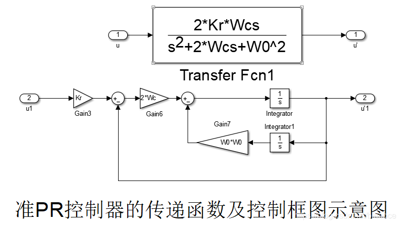

- [[滤波算法]]
	- 二阶带阻滤波器
		- [数字信号处理6：IIR滤波器设计](https://blog.csdn.net/zuguorui/article/details/116402961)
		- y[n]+a[1]y[n−1]+a[2]y[n−2]+⋯+a[M]y[n−M]
		  =b[0]x[n]+b[1]x[n−1]+⋯+b[N]x[n−N]
		- FIR滤波器来说，输出只与输入有关，即a [ n ] = 0
			- y[n]=b[0]x[n]+b[1]x[n−1]+⋯+b[N]x[n−N]
		- IIR滤波器的输出不仅与输入有关，还与过去的输出有关，即a [ n ]不总是为0。
			- N=2
				- y[n]+a[1]y[n−1]+a[2]y[n−2] =b[0]x[n]+b[1]x[n−1]+b[2]x[n−2]
				- y[n] = - a[1]y[n−1] - a[2]y[n−2] + b[0]x[n] + b[1]x[n−1] + b[2]x[n−2]
	- 二阶带通滤波器
		- SOGI方法
		- [基于SOGI的锁相环的代码实现](https://blog.csdn.net/sinat_40597468/article/details/125582569)
			- 基于SOGI实现的带通滤波器如图2所示，通过该二阶带通滤波器（BPF），可以实现滤除电网谐波，留下基波分量，同时生成两个相互正交的信号。
				- 
			-
- [[电力电子]]控制算法
	- 锁相环（PLL）
		- https://zhuanlan.zhihu.com/p/296770446
	- Clark变换与Park变换
		- https://zhuanlan.zhihu.com/p/293470912
	- 空间矢量调制（SVPWM）
		- https://zhuanlan.zhihu.com/p/303998608
	- 二阶比例谐振控制[[PR]]
		- 二阶PR控制是一种在电力电子和控制系统中广泛应用的控制策略，特别是在需要消除稳态误差和抑制特定频率谐波的应用中。PR控制器（比例-谐振控制器）通过引入谐振环节来增强对特定频率的增益，从而实现对交流信号的无静差跟踪和谐波抑制。
		- PR控制器的基本传递函数形式为：
			- $$H(s)=K_p+\frac{2K_rs}{s^2+w_0^2}$$
			- $K_p$比例系数，$K_r$是谐振系数，$w_0$是谐振角频率
			- {:height 363, :width 631}
	- 重复控制[[RC]]
		- 重复控制是一种基于内模原理的控制策略，主要用于处理周期性输入信号和抑制周期性干扰。其核心思想是通过在控制系统中加入目标信号的模型，利用过去周期的误差信息来改善当前的控制效果，从而实现对**周期性信号**的高精度跟踪和对周期性干扰的有效抑制。
			- 对于阶跃信号l(t)，其拉斯变换为1/s，所以包含PI控制器可以无静差的跟踪阶跃信号。对于交流信号
			- $$L(sin(wt))=  \frac{w}{s^2+w^2}$$
			- PI控制器是无法无静差的跟踪正弦信号的。PR控制器可以无静差的跟踪交流信号
		- 逆变器的重复控制
			- https://blog.csdn.net/liuzhijun301/article/details/80445590
			  background-color:: red
			- 编程实现
				- 重复控制传递函数$\frac{y}{e}=\frac{K_rZ^{-N+K}}{1-0.95Z^{-N}}$
				- 差分方程$y(m)-0.95y(m-N)=K_re(m-N+K)$
		- [重复控制算法研究](https://zhuanlan.zhihu.com/p/669194234#:~:text=%E9%87%8D%E5%A4%8D%E6%8E%A7%E5%88%B6%E6%98%AF%E5%9F%BA%E4%BA%8E%E5%86%85%E6%A8%A1%E5%8E%9F%E7%90%86%E7%9A%84%E4%B8%80%E7%A7%8D%E6%8E%A7%E5%88%B6%E6%80%9D%E6%83%B3%EF%BC%8C%E5%AE%83%E7%9A%84%E5%86%85%E6%A8%A1%E6%95%B0%E5%AD%A6%E6%A8%A1%E5%9E%8B%E6%8F%8F%E8%BF%B0%E7%9A%84%E6%98%AF%E5%91%A8%E6%9C%9F%E6%80%A7%E7%9A%84%E4%BF%A1%E5%8F%B7%EF%BC%8C%E5%9B%A0%E8%80%8C%E4%BD%BF%E5%BE%97%E9%97%AD%E7%8E%AF%E6%8E%A7%E5%88%B6%E7%B3%BB%E7%BB%9F%E8%83%BD%E5%A4%9F%E6%97%A0%E9%9D%99%E5%B7%AE%E5%9C%B0%E8%B7%9F%E8%B8%AA%E5%91%A8%E6%9C%9F%E4%BF%A1%E5%8F%B7%E3%80%82%E5%8D%95%E4%B8%80%E9%A2%91%E7%8E%87%E7%9A%84%E6%AD%A3%E5%BC%A6%E6%B3%A2%E6%98%AF%E5%85%B8%E5%9E%8B%E7%9A%84%E5%91%A8%E6%9C%9F%E4%BF%A1%E5%8F%B7%EF%BC%8C%E5%AE%83%E7%9A%84%E6%95%B0%E5%AD%A6)
			- 定义
				- 重复控制： 加到被控对象的输入信号除偏差信号外，还叠加了一个“过去的控制偏差”，该偏差是上一个周期该时刻的控制偏差。**把上一次运行时的偏差反映到现在，和“现在的偏差”一起加大被控对象进行控制。**
			- 优点
				- 经过几个周期的重复控制之后可以大大提高系统的跟踪精度，改善系统品质。重复控制不仅适用于跟踪周期性输入信号，也可以抑制周期性干扰。
			- 在重复控制中，一般期望重复控制用在高频段的增益渐小，为此，在重复控制经常加入低通滤波器
			- 内模原理
				- 重复控制是基于内模原理的一种控制方法。所谓内模原理，即在一个闭环调节系统中，在其反馈回路中设置一个内部模型，使该内部模型能够很好地描述系统外部信号特性，通过该模型的作用可使得系统获得理想的指令跟踪特性，具有较强的扰动抑制能力。内模原理的本质是将系统外部信号动态模型（即为内模）植入控制系统内以此来构成高精度的反馈控制系统，使系统能够无静差地跟随输入信号。
			-