- 交流量的相量表示法
	- [[相量法]]是一种将正弦交流量（如电压、电流）用复数形式来表示的方法。这种方法通过复数的模（幅值）和相位角来描述正弦量，从而简化了电路分析和计算过程。
	- 在相量表示法中，一个正弦量可以用复数形式表示，例如$A=a+jb$。
		- 根据欧拉公式，$e^{j\theta}=cos \theta +j sin \theta$，可将复数形式转化为指数形式$A=re^{j\theta}$或极坐标形式$A=r\angle \theta$
	- {{embed ((6732b030-4da0-48c9-810b-9d8c9457fec9))}}
	- 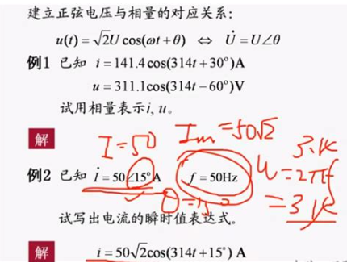
	- 定义：[[相量图]]是将[[$red]]==同频率==的多个正弦量按大小与相位关系绘制的图形，用于表示正弦量的相加。相量图中的矢量长度表示==正弦量的有效值==，矢量的方向表示初相位角。
	- 
		- 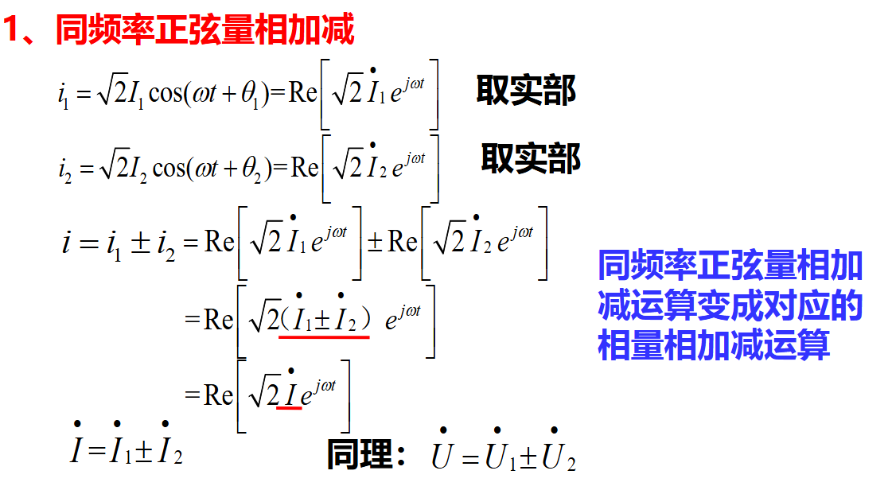
		- 正弦量的微分，其对应的相量等于原正弦量对应的相量乘以jw
		- 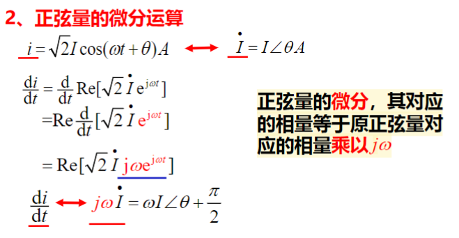
		- 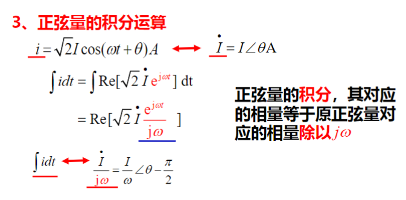
-
- 锁相环[[PLL]]
	- PLL的工作流程是：将输出 vo(t) 反馈到输入端，经过环路的调节，实现 vo(t) 的角频率与输入 vi(t) 相等，从而输入信号与输出信号之间的相位差恒定，即环路到达了“锁定”状态，从而实现锁相。
	- 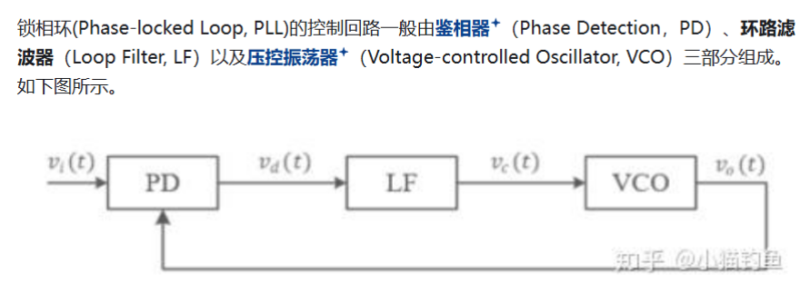
	- 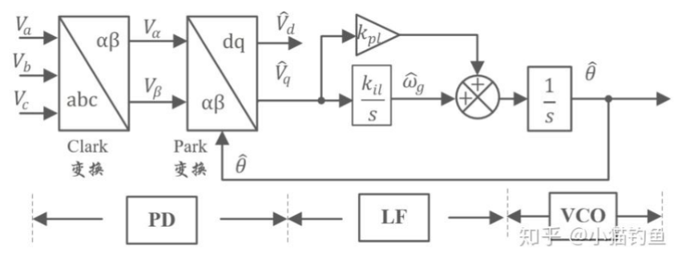
-
- [[传递函数]]离散化
	- 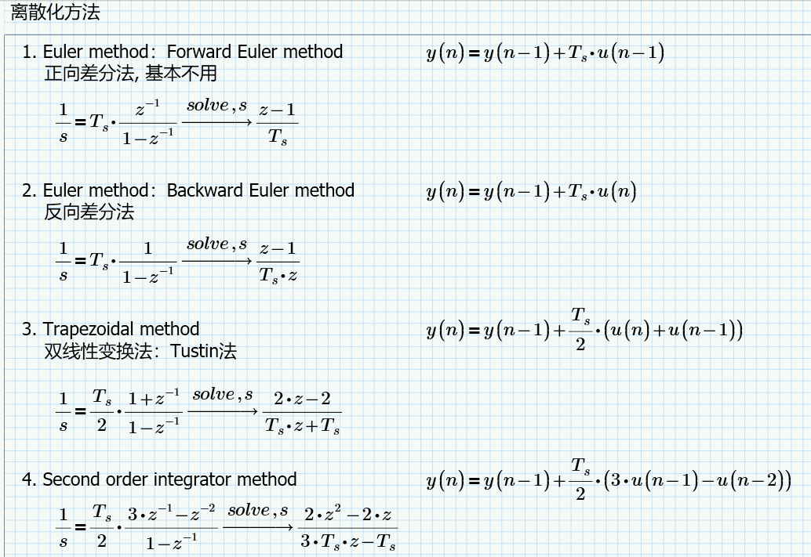
-
- 坐标变换
	- 
		- 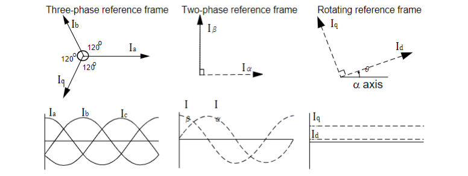
	- [[Clarke]]变换和[[Park]]变换是电力系统和电机控制中常用的坐标变换方法，它们主要用于将三相交流系统转换为更易于控制的两相或旋转坐标系。
	- https://zhuanlan.zhihu.com/p/293470912
	  background-color:: red
	- Clarke变换
		- 主要目的是将三相静止坐标系（abc）转换为两相静止坐标系（αβ）。这种变换通过矩阵乘法实现，通常用于将三相电流或电压转换为两相电流或电压，从而简化了后续的处理过程。
			- 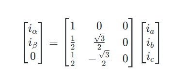
			- 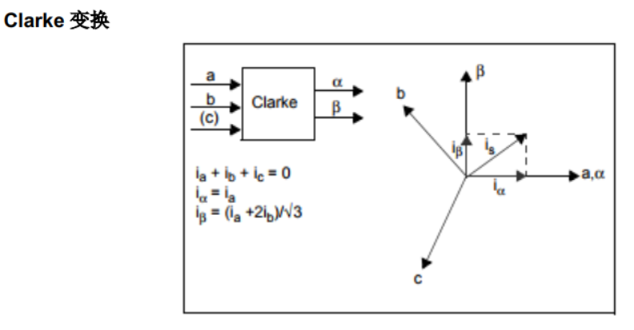
	- Park变换
		- Park变换则进一步将Clarke变换后的αβ坐标系转换为旋转坐标系（d-q）。这种变换通过乘以一个旋转矩阵来实现，使得坐标系与转子的磁通同步旋转，从而简化了电机控制中的磁场分析。Park变换的基本公式如下：
		- 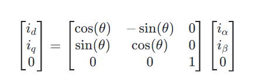
		- 其中，θ是转子磁通相对于α轴的角度。Park变换的结果是将电流矢量投影到d-q坐标系中，d轴与转子磁链方向一致，q轴垂直于d轴
		- 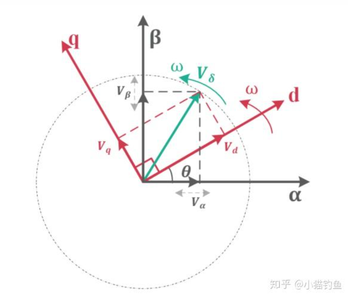
		-
	- 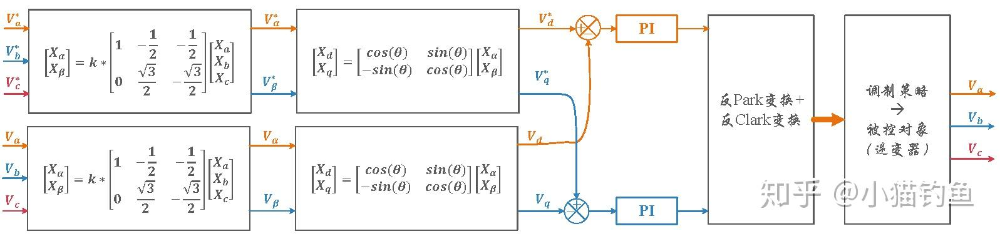