- [[buck]]电路[[传递函数]]分析
  collapsed:: true
	- 参考
	  collapsed:: true
		- [绝绝子，Buck电路的传递函数，咱就是说一整个把它给解析了！-电子发烧友网](https://www.elecfans.com/d/2350091.html)
	- 我们很容易观察到这样的现象：把一个圆球放在山尖尖上，稍微施加一点扰动，哪怕微风徐徐，它也很容易滑下山坡。当把这个圆球放在山谷，即使扰动很大，不管风吹雨打，它也岿然不动。 所以我们会说石头放在山谷里，比放在山尖尖上更加稳定。
		- 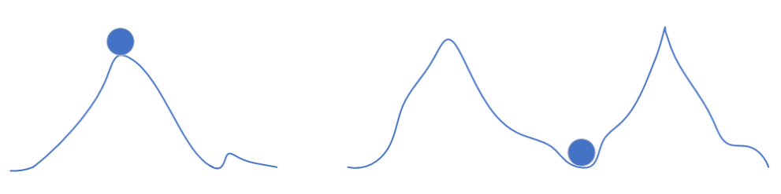
	- 而电源的稳定如何比较呢？其实道理也差不多，看扰动对系统工作的影响大不大。
		- 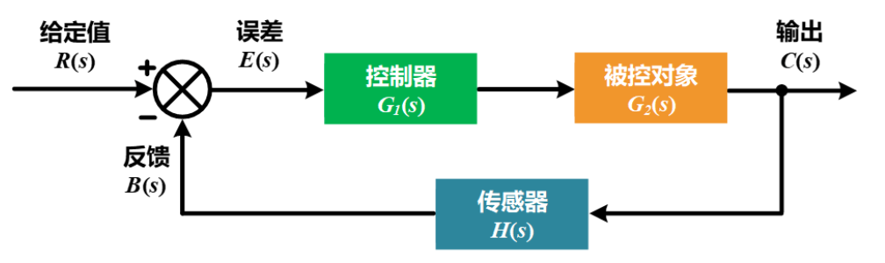
	- 断开系统的反馈通路，以**反馈信号B(s)**作为**输出**、**误差信号E(s)**作为**输入**而确定的传递函数，称为该系统的**开环传递函数**。需要注意的是，开环传递函数并非字面意义上开环控制系统的传递函数。
		- 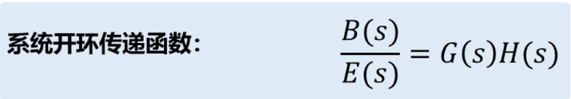
	- 描述**输出信号C(s)**与**输入信号R(s)**之间关系的传递函数，称为该系统的**闭环传递函数**。
		- 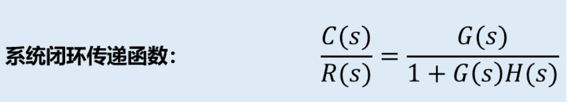
	- 闭环传递函数的分母表达式称为系统的特征式，令该特征式为0，即可得到该系统的特征方程，特征方程的解即为系统闭环传递函数的极点，反映了该闭环控制系统的本质特征，而由特征方程表达式可以看出，闭环系统稳定性实则与系统开环传递函数息息相关。因此我们需要探究系统的开环传递函数。
	- 对于Buck电路，我们可以拆解成几个级联的模块：脉宽调制比较器、开关网络、LC滤波器、分压反馈电路、误差放大器及其补偿网络。误差放大器及其补偿网络组成其实也是由两部分构成：做差和补偿。但是实际应用中反馈信号是加在误差放大器的反向输入端的，二者功能合一。
		- 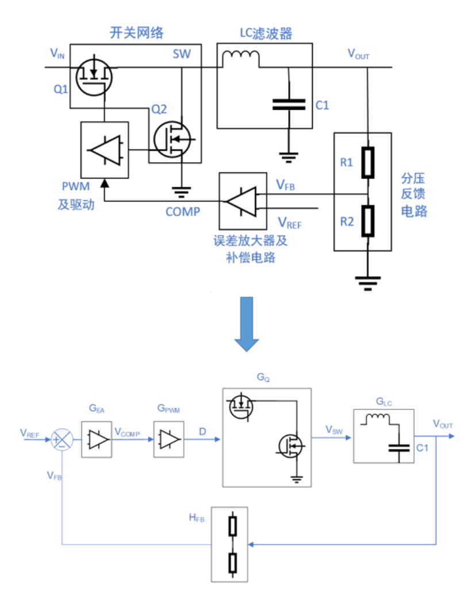
	- 1.误差放大器及其补偿网络
		- 根据使用的是传统运算放大器还是跨导运算放大器，其传递函数形式也不同。在控制环路中，我们只关注变化或者扰动，而不关注直流值。
		- 传统运算放大器是一个单纯的电压放大器件，从交流的角度来说，**反馈传递函数H(S) =-Z2/Z1**，与RF2无关。这就是为什么我们看到很多DCDC芯片调节输出电压都是建议用户固定上分压电阻的数值，改变下分压电阻。
		- 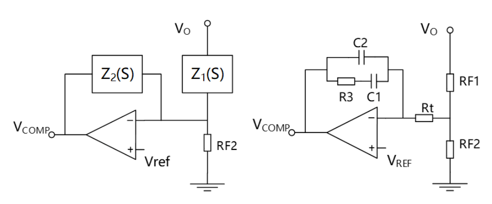
		- 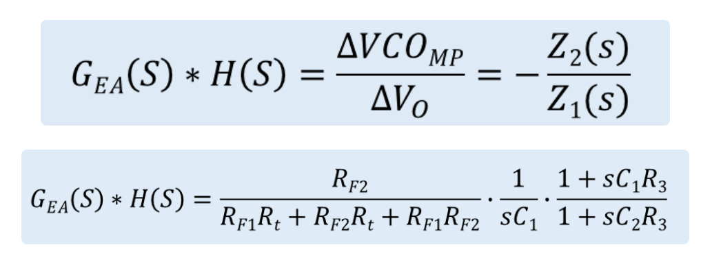
		- 跨导运算放大器是一个电压到电流的放大器件，如果两个引脚之间存在电压差，会转换成输出引脚上的电流变化量，**电流×Z2(S)**得到**VCOMP**。同样，由于是交流分析，我们可以把Vref忽略掉，反馈传递函数如图上所示，使用跨导运算放大器的芯片反馈传递函数与RF2有关。
		- 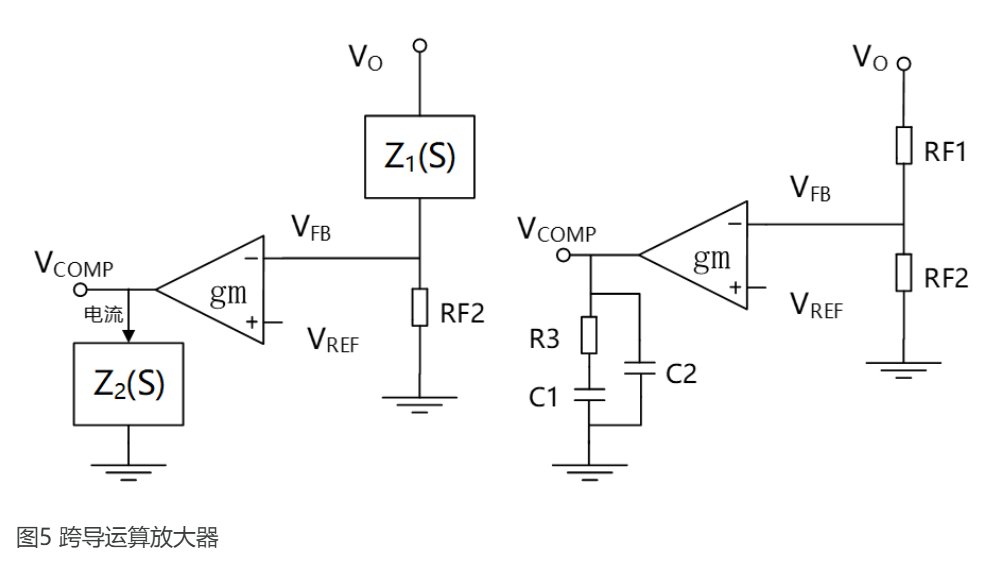
		- 如果以II型补偿计算为例，传统运算放大器的反馈传递函数HS和跨导运算放大器的传递函数分别如图所示。
		- 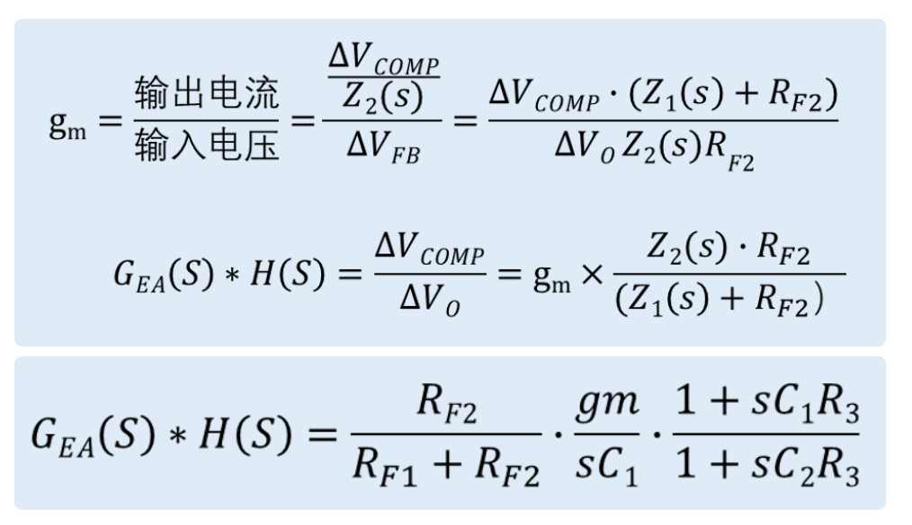
	- 2.**脉宽调制器**
		- 下面我们来看脉宽调制器的传递函数GPWM是如何得来的，从电路上来看，PWM脉宽调制器其实是一个比较器，它的一个输入是控制信号VCOMP，由前面的误差放大器产生。另一个输入是RAMP，电压模式由内部时钟产生，电流模式由电流斜坡产生。通过比较VCOMP和RAMP这两个信号，输出PWM信号驱动开关管。
		- 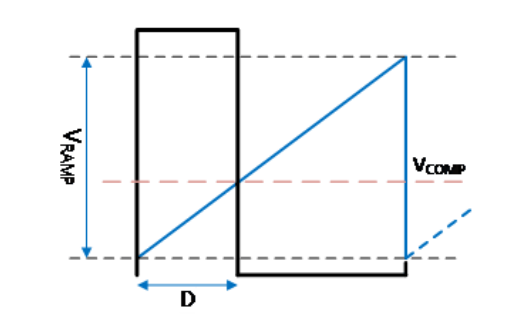
		- 如果分压器采得的输出电压高于参考电压VREF，VCOMP信号会下降，这将使得占空比D减小，从而使得输出电压下降。
		- 如果分压器采得的输出电压低于参考电压VREF，VCOMP信号会上升，这将使得占空比D增加，从而使得输出电压上升。
		- 根据这个几何关系，我们可以很容易得到占空比：
			- 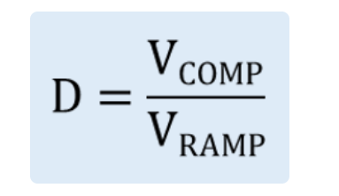
		- 从而得到脉宽调制器的传递函数为：
			- 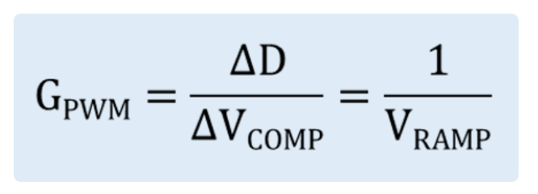
	- 3.**开关网络**
		- 对于开关网络的传递函数，PWM信号驱动开关管开通和关断，将输入电压VIN斩波成开关电压SW，就像用菜刀砍瓜切菜一样，把平整的直流波斩成了方波。SW电压经过LC滤波就是输出电压，所以低频下SW电压的平均值就是输出电压，所以对于开关管来说传递函数约等于VIN。
		- 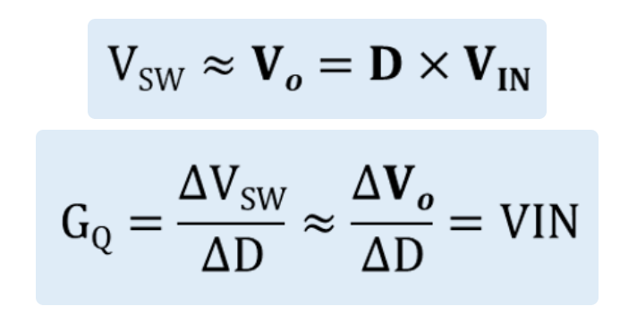
	- 4.LC滤波器
		- 对于LC滤波器，本质上是一个二阶滤波器，负责把前面传递过来的开关波形滤成稳定的直流电压。我们这里用电阻R代表负载，它的传递函数为VOUT/VSW，把容抗与电阻并联与感抗分压就可以推导出来。
		- 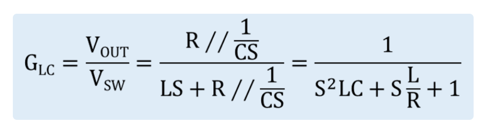
	- 求得各模块的传递函数后，把这几项者相乘我们就得到了系统的开环传递函数，以II型补偿的传统运算放大器为例的开环传递函数计算如下图所示。
	- 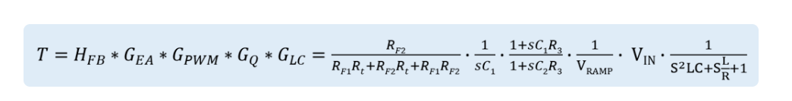