- [[EAI]] [[ICS]]
	- 讲座
		- [中国自动化学会副理事长李少远：工业大数据的知识表达和利用_哔哩哔哩_bilibili](https://www.bilibili.com/video/BV1K6CFYZEXz/?spm_id_from=333.1387.favlist.content.click&vd_source=f92eb336806a7a264c052ec82b31d75d)
		- AI大模型如何推动实际工业生产运行优化？
		- 研究背景
		  collapsed:: true
			- 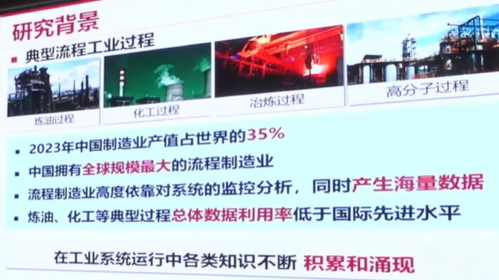
			- 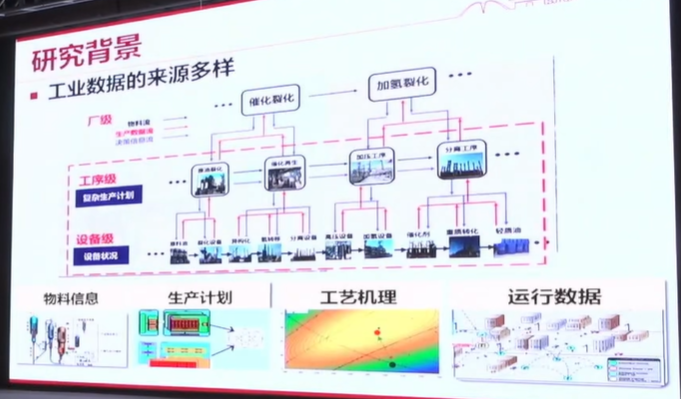
			  id:: 676fa940-92b5-4b70-a9e0-d21b1f932dab
			- 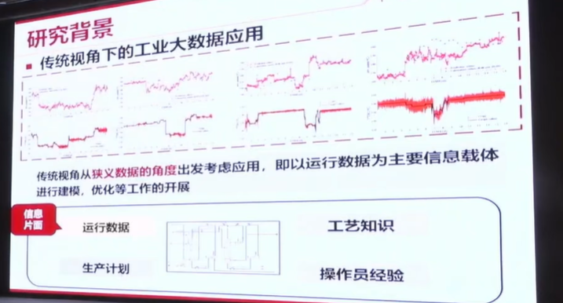
				- 工业运行数据，提取操作经验
			- 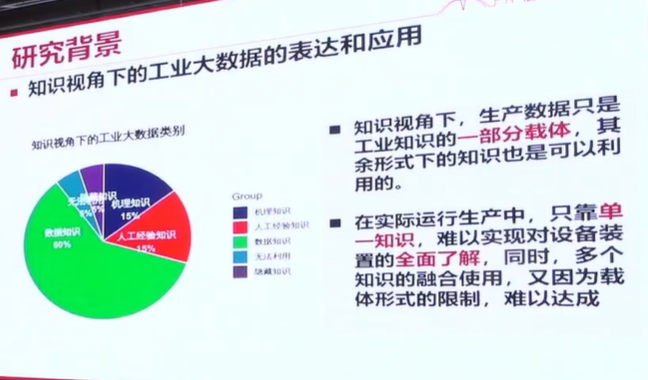
			- 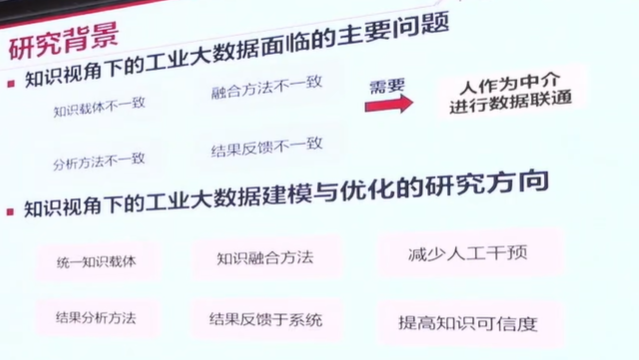
		- 研究内容
			- 1.隐式知识的发现和利用
			  collapsed:: true
				- 人的经验、运行机理等形成[[知识图谱]]
					- 知识图谱：模型的进一步延伸
				- 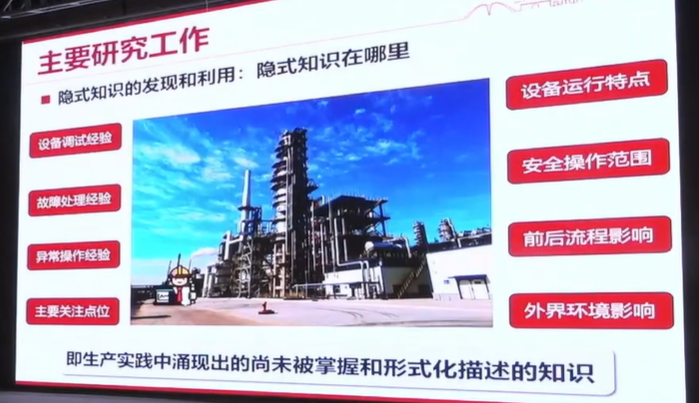
				- 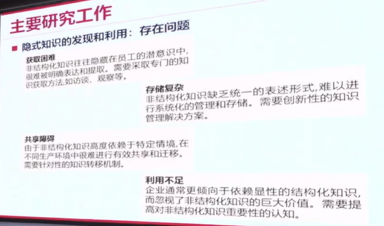
				- 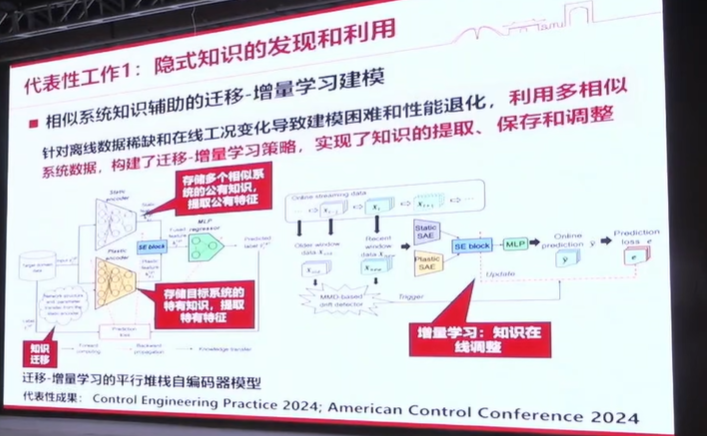
				- 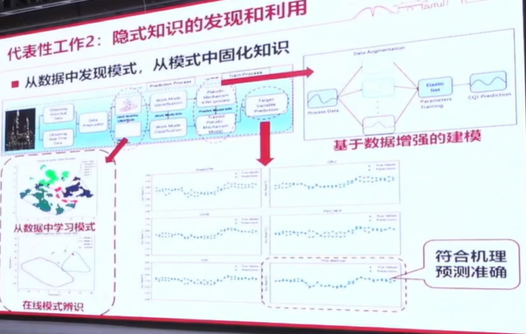
			- 2.融合关系知识的数据驱动建模和优化
			  collapsed:: true
				- 离线知识图谱+实时运行数据+X->推理
				- 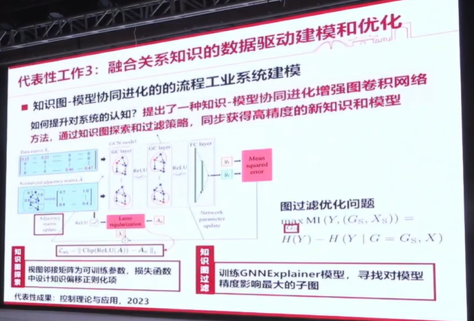{:height 473, :width 686}
				- 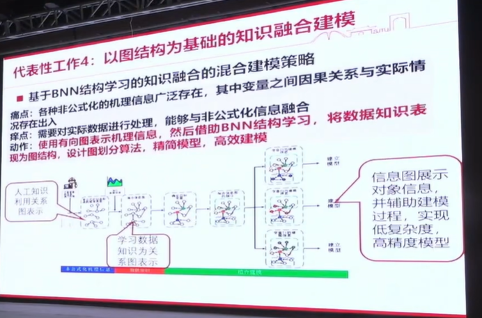
			- 3.融合公式化机理知识的数据驱动建模和优化
			  collapsed:: true
				- 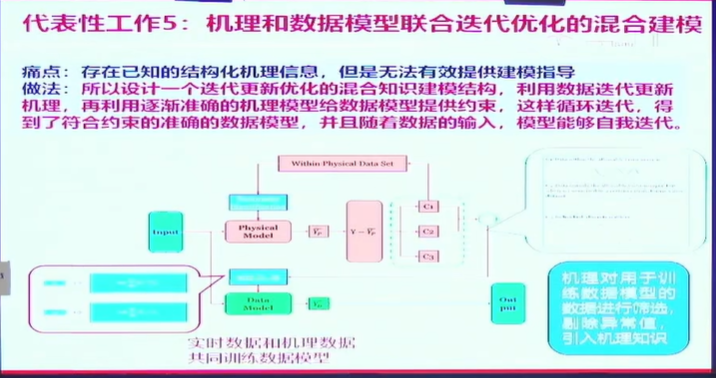
		- 总结展望
		  collapsed:: true
			- 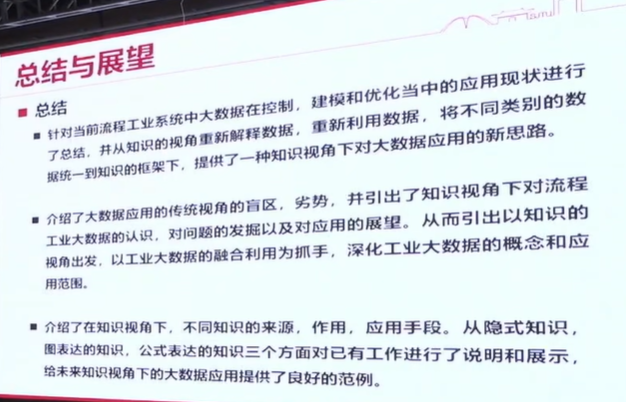
			- 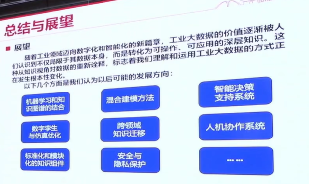