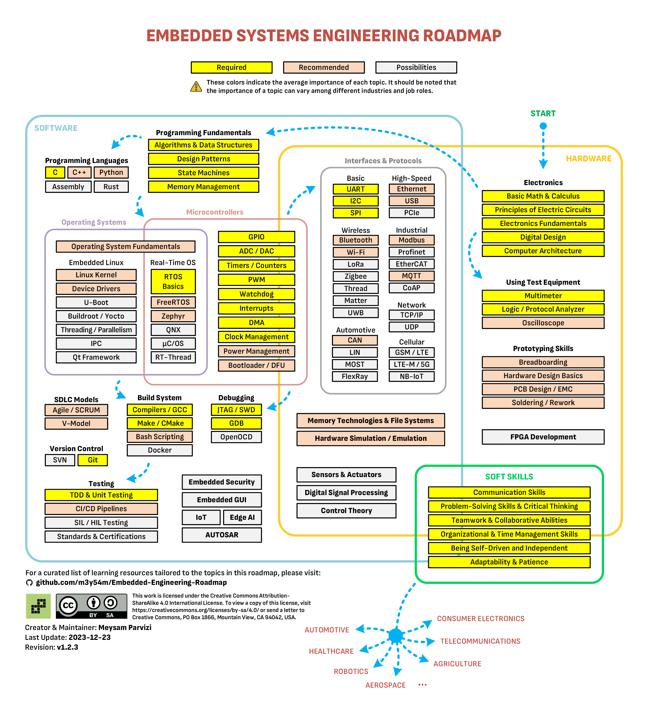

## 嵌入式软件工程师职业路径
	- [m3y54m/Embedded-Engineering-Roadmap: A comprehensive roadmap for aspiring Embedded Systems Engineers, featuring a curated list of learning resources.](https://github.com/m3y54m/Embedded-Engineering-Roadmap?tab=readme-ov-file)
	- 