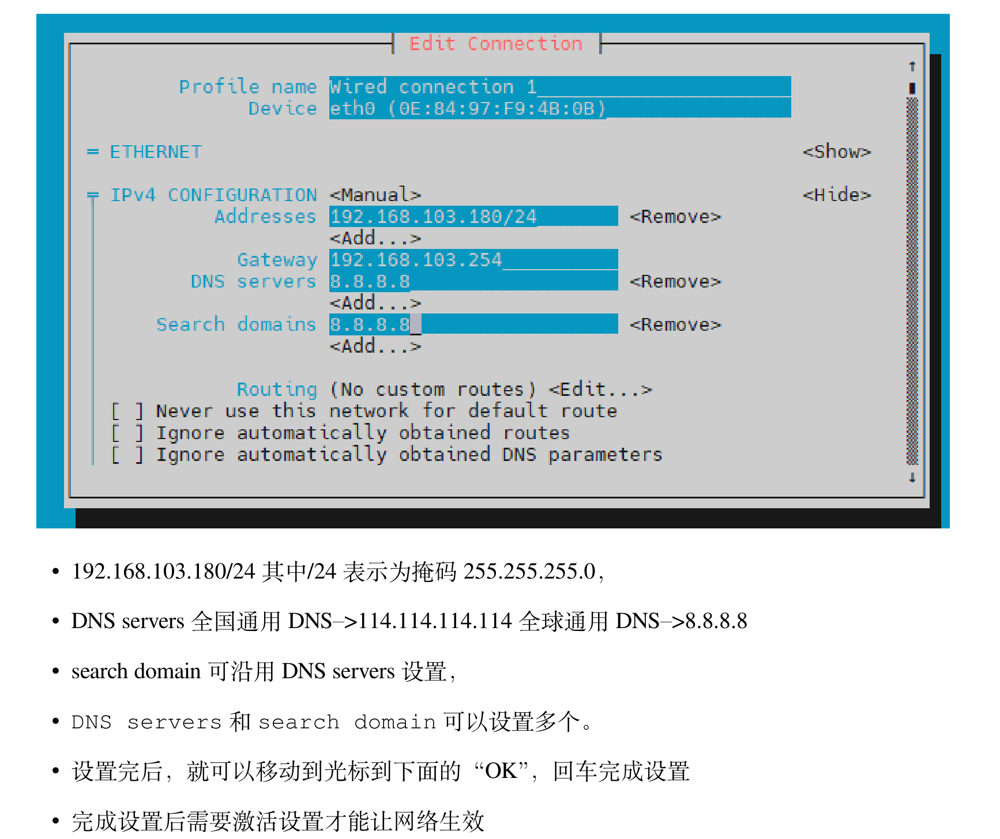

- 启机条件
	- eMMC/SD卡烧写有系统镜像
	- type-c供电
- 系统登录[[ssh]]
	- 启机HDMI连接显示屏会刷启机打印信息
	- 外围局域网方式
		- 手机热点(同一WiFi热点下)-鲁班猫wifi连接-电脑WiFi连接（ipad wifi连接）
		- 电脑ssh登录访问鲁班猫系统
		- 登录ip为wifi网口ip
		- 或ipad借助Termius登录
		  background-color:: purple
	- 内围局域网
		- 电脑-以太网（网线）-鲁班猫
		- ssh登录访问
		- 登录ip为板卡以太网口ip
- linux设置IP地址
	- 设置开发板IP为192.168.5.9
	- ifconfig eth0 192.168.5.9 up
	  background-color:: red
	- DONE 会丢失？如何固化解决
	  :LOGBOOK:
	  CLOCK: [2024-06-29 Sat 11:58:02]--[2024-06-29 Sat 11:58:02] =>  00:00:00
	  :END:
		- 设置静态IP地址
			- [5. 网络连接及静态配置 — 快速使用手册—基于LubanCat-H618系列板卡 文档 (embedfire.com)](https://doc.embedfire.com/linux/h618/quick_start/zh/latest/quick_start/network/network2.html#id13)
			- ==nmtui==——命令行图像化工具
			- 
	- 测试连接
		- ping 192.168.5.9 -c 4
- 默认登录密码
	- cat
	- temppwd
-