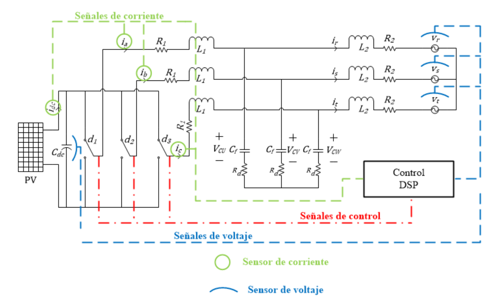

- 级联H桥SVG
	- 
	- 
	- 
-
- 参考项目
	- 一个简单的光伏逆变器
		- 
		- 作者博客
		  collapsed:: true
			- [Home](https://sites.google.com/view/pablovela/home)
		- [Thesis: Suboptimal Operation of Electrical Generation based on Solar Panels](https://sites.google.com/view/pablovela/solar-energy/thesis-research)
		- github
			- [pvela2017/Three-phase-inverter-DSP-TMS320F28335: DSP TMS320F28335 C Code for Three Phase VSI](https://github.com/pvela2017/Three-phase-inverter-DSP-TMS320F28335)