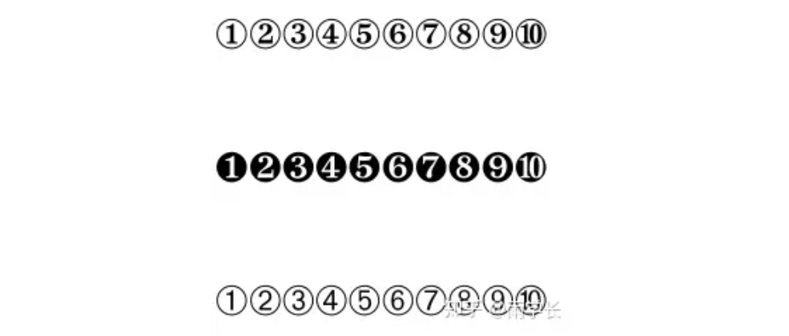

- [[latex]] 用法整理
	- [Latex 用法整理 - 知乎 (zhihu.com)](https://zhuanlan.zhihu.com/p/685180575)
		- ```
		  \ding{172}\ding{173}\ding{174}\ding{175}\ding{176}\ding{177}\ding{178}\ding{179}\ding{180}\ding{181}
		  
		  \ding{182}\ding{183}\ding{184}\ding{185}\ding{186}\ding{187}\ding{188}\ding{189}\ding{190}\ding{191}\\
		  
		  \ding{192}\ding{193}\ding{194}\ding{195}\ding{196}\ding{197}\ding{198}\ding{199}\ding{200}\ding{201}\\
		  
		  \ding{202}\ding{203}\ding{204}\ding{205}\ding{206}\ding{207}\ding{208}\ding{209}\ding{210}\ding{211}\\
		  ```
		- 