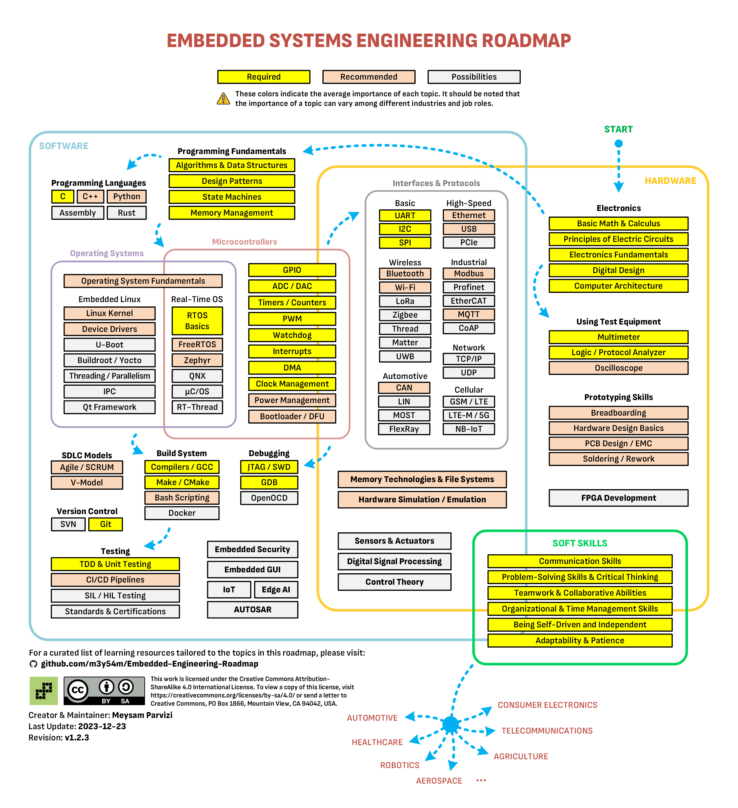

## 嵌入式软件工程师基本功
	- [m3y54m/Embedded-Engineering-Roadmap: A comprehensive roadmap for aspiring Embedded Systems Engineers, featuring a curated list of learning resources.](https://github.com/m3y54m/Embedded-Engineering-Roadmap?tab=readme-ov-file)
	- 
- [[EAI]]
	- 嵌入式AI
	- [AI嵌入式系统：算法优化与实现 (豆瓣) ](https://book.douban.com/subject/35680669/)
	- _(Z-Library)_1728896874018_0.pdf)
- [[ICS]]
	- 工业控制系统
-