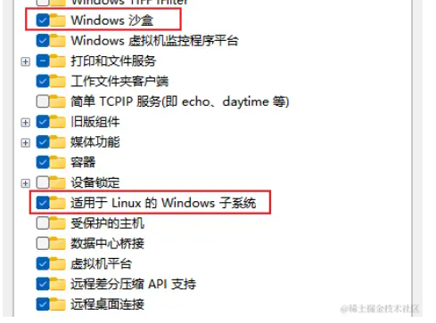

tags:: linux, wsl

- [💪WSL2是最好的linux发行版！新版wsl2安装教程，并搭建前端开发环境 - 掘金 (juejin.cn)](https://juejin.cn/post/7320127815356481546)
- windows打开设置支持wsl
	- 按下 win 键，或点击任务栏的搜索框，输入【windows 功能】，点击打开【启用或关闭 windows 功能】
	- 
	- 查看各种可安装的发行版 linux
		- wsl -l -o
	- 选择 Ubuntu-22.04
		- wsl --install Ubuntu-22.04
	- 将默认版本设置为 wsl2
		- wsl --set-default-version 2
	- 查看安装版本
		- wsl -l  -v
	- 移动位置
		- ```
		  wsl --shutdown
		  wsl --export Ubuntu-22.04 D:\Ubuntu-22.04_bak.tar
		  mkdir D:\Ubuntu-22.04
		  wsl --import  Ubuntu-22.04  D:\Ubuntu-22.04  D:\Ubuntu-22.04_bak.tar
		  ```