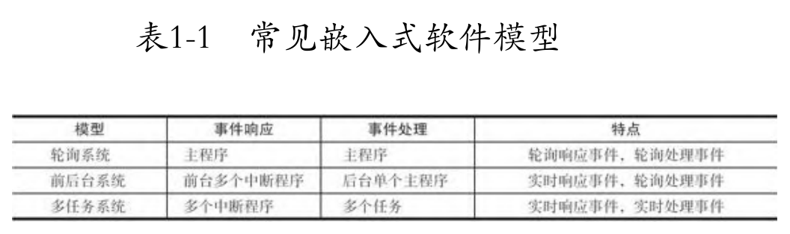

tags:: 软件架构

- _--_刘旭明_--_9787111476078_--_89d693b4550f625d461dae8a88ee5baa_--_Anna’s_Archive_1718630097688_0.pdf)
- 
- [嵌入式软件开发常用的3种架构_嵌入式开发框架-CSDN博客](https://blog.csdn.net/an520_/article/details/124877026)
- 裸机系统（轮询、前后台），实时操作系统RTOS
- 轮询系统
  collapsed:: true
	- 用于那些只需要顺序执行代码且不需要外部事件来驱动的就能完成的事情，当有外部事件驱动时(例如按键)，实时性就会降低。
	- ```c
	  int main(void)
	  {   
	    /* 硬件相关初始化 */  
	    HardWareInit();  
	    
	    /* 无限循环 */  
	    While(1) 
	    {       
	      /* 处理事情 1 */     
	      DoSomething1();     
	      
	      /* 处理事情 2 */    
	      DoSomethingg2();  
	    }
	  }
	  ```
- 前后台系统
  collapsed:: true
	- 前后台系统是在轮询系统的基础上采用了中断处理，外部事件的响应在中断里面完成，事件的处理还是回到轮询系统中完成，中断响应称为前台， main 函数里面的无限循环称为后台
	- ```c
	  int flag1 = 0;
	  int flag2 = 0;
	  
	  int main(void)
	  {	
	    /* 硬件相关初始化 */
	    HardWareInit(); 
	    
	    /* 无限循环 */
	    While(1)
	    {
	      if (flag1)
	      {  
	        DoSomething1(); /* 处理事情 1 */
	      }
	      if (flag2) 
	      {  
	        DoSomethingg2(); /* 处理事情 2 */
	      }
	    }
	  }
	  
	  void ISR1(void)
	  {     
	    /* 置位标志位 */   
	    flag1 = 1;  
	    
	    /* 如果事件处理时间很短，则在中断里处理 如果事件处理时间比较长，则回到后台 */   
	    DoSomething1();
	  }
	  
	  void ISR2(void)
	  {    
	     /* 置位标志位 */
	    flag2 = 2;   
	    
	    /* 如果事件处理时间很短，则在中断里处理,如果事件处理时间比较长，则回到后台*/   
	    DoSomething2();
	  }
	  
	  ```
	- 虽然事件的响应和处理是分开了，但是事件的处理还是在后台里顺序执行的，但相比轮询系统，前后台系统确保了事件不会丢失，再加上中断具有可嵌套的功能，这可以大大的提高程序的实时响应能力。在一般简单的中小型项目中，使用前后台的软件架构效果更好。
- **RTOS：Real Time Operating System，实时操作系统**
  collapsed:: true
	- RTOS也称为多线程/任务系统，相比前后台系统，多线程/任务系统的事件触发是在中断中完成的，但事件的处理是在线程/任务中完成的。在多线程/任务系统中，线程/任务跟中断一样，也具有优先级，当一个紧急的事件/信号在中断被触发之后，事件/信号对应的线程/任务的优先级足够高，就会立马得到响应。
	- 相比前后台系统，多线程/任务系统的实时性更高。并且，当所有的线程/任务处于等待状态时，系统会进入idle线程/任务，在idle线程/任务里面可以让CPU进入stop、standy等低功耗模式，降低系统功耗。
	- ```c
	  os_event event1;
	  os_event event2;
	  
	  int main(void)
	  {   
	    HardWareInit(); /* 硬件相关初始化 */   
	    RTOSInit(); /* OS 初始化 */   
	    RTOSStart(); /* OS 启动，开始多线程调度，不再返回 */
	  }
	  
	  void ISR1(void)
	  { 
	    os_set_event(event1); /* 触发event1事件 */
	  }
	  
	  void ISR2(void)
	  {   
	    os_set_event(event2); /* 触发event2事件 */
	  }
	  
	  void Task1(void)  //优先级1
	  {  
	    while(1)  
	    {      
	      os_event_wait(event1);   
	      DoSomething1();  
	    }
	  }
	  
	  void Task2(void) //优先级2
	  {  
	    while(1)  
	    {     
	      os_event_wait(event2);     
	      DoSomething2();  
	    }
	  }
	  
	  void Task_idle(void)//优先级最低
	  {  
	    cpu_stop();
	  }
	  ```
	- 在多线程/任务系统中，根据程序的功能，我们把这个程序主体分割成一个个独立的，无限循环且不能返回的小程序，称之为线程/任务。每个线程/任务都是独立的，互不干扰的，且具备自身的优先级，由操作系统进行调度管理。
	- 对于一些复杂的需求，加入操作系统反而使我们的编程变得简单了。整个系统随之带来的额外开销是操作系统占据的FLASH 和 RAM。如今单片机的 FLASH 和 RAM 是越来越大，完全能够满足RTOS那点开销。
- #+BEGIN_CAUTION
  **RTOS因为有了任务优先级、任务调度、事件/信号量等管理机制，**
  	1. 能更有效区处理紧急任务
  	2. 能在CPU没有事情需要处理时，进入空闲任务方便低功耗管理
  **而裸机的前后台系统，更多的是**
  	1. 要么CPU一直顺序查询和顺序执行，一直跑；没有低功耗的概念，无法实现高优先级的事情先处理。
  	2. 要么CPU通过定时器，周期性休眠，周期性运行，实时性差
  #+END_CAUTION
- **RTOS因为有了任务优先级、任务调度、事件/信号量等管理机制，**
	- 1. 能更有效区处理紧急任务
	- 2. 能在CPU没有事情需要处理时，进入空闲任务方便低功耗管理
	- **而裸机的前后台系统，更多的是**
	- 1. 要么CPU一直顺序查询和顺序执行，一直跑；没有低功耗的概念，无法实现高优先级的事情先处理。
	- 2. 要么CPU通过定时器，周期性休眠，周期性运行，实时性差
-