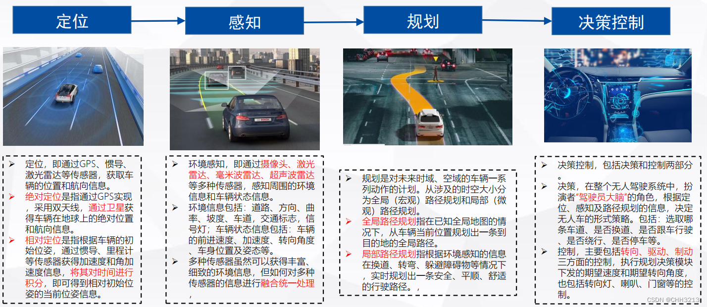

tags:: 控制算法，PID，LQR, MPC，python，c++，CPS

- 自动驾驶规控算法入门路线
  :LOGBOOK:
  CLOCK: [2024-08-23 Fri 21:13:12]--[2024-08-23 Fri 21:13:13] =>  00:00:01
  :END:
- 该博主[一半是火一半是光的博客 (chh3213.github.io)](https://chh3213.github.io/)搜集的资料作为入门
	- [【自动驾驶】总目录（持续更新）_自动驾驶归档清单-CSDN博客](https://blog.csdn.net/weixin_42301220/article/details/124832403)
	  id:: 66780ca1-a274-42e9-8a14-f5187950900d
		- 自动驾驶理论知识
		  collapsed:: true
			- 
	- [CHH3213/chhRobotics: 自动驾驶规划控制python代码实现 (github.com)](https://github.com/CHH3213/chhRobotics)
	  background-color:: red
		- tags:: python, 车辆模型，坐标系转换，路径规划，决策控制，预测
	- [CHH3213/chhRobotics_CPP: 自动驾驶规划控制常用算法c++代码实现 (github.com)](https://github.com/CHH3213/chhRobotics_CPP)
	  background-color:: blue
		- tags:: ubuntu, c++，路径规划，决策控制, 预测
	- [CHH3213/Books: 书籍资料汇总 (github.com)](https://github.com/CHH3213/Books)
		- 
		- 计算几何学
			- [CHH3213/Math_Geometry: These are Pratical Math and Geometry Algorithms! (github.com)](https://github.com/CHH3213/Math_Geometry)
			- [【自动驾驶】自动驾驶planning方向中常用的计算几何学知识 01_哔哩哔哩_bilibili](https://www.bilibili.com/video/BV1D34y1N7dp/?spm_id_from=333.999.0.0&vd_source=f92eb336806a7a264c052ec82b31d75d)