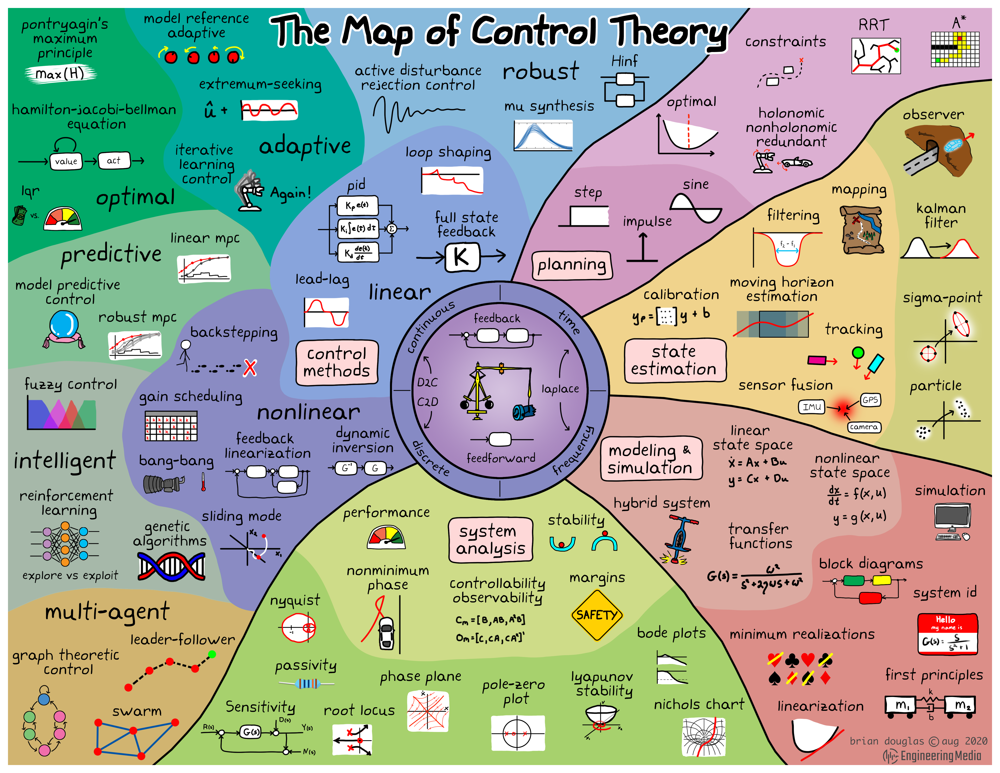

- 参考书籍
	- _富兰克林_鲍威尔_李中华译_--_电子工业出版社_1728743976133_0.pdf)
	- 
	- _钱学森_-_工程控制论-上海交通大学出版社_(2007)_1728378439895_0_1728895949299_0.pdf)
	- _1729479720762_0.pdf)
- 控制理论地图
  collapsed:: true
	- 
- 案例分析
	- [[buck]]电路传递函数
- 拉普拉斯变换
	- [拉普拉斯变换与拉普拉斯逆变换的常用结论与经典公式-CSDN博客](https://blog.csdn.net/wh_STUDY/article/details/126403817)
- 控制算法
	- [控制系统的数学模型有几种？](https://mp.weixin.qq.com/s?__biz=Mzk0OTU2ODg5OQ==&mid=2247483886&idx=1&sn=975bcc2ca70c2663e289493a909f441b&chksm=c3571502f4209c1406ee07cc4d22bf38ae65c037b6cd2d90bc08436b638a08934bc5961acdc8&mpshare=1&scene=1&srcid=0704f9D7zbWlz5vKg093zJ8Q&sharer_shareinfo=4e42fb56df2d4d1bcba41ed9f26d8c49&sharer_shareinfo_first=4e42fb56df2d4d1bcba41ed9f26d8c49)
	- [[pid]]
	- [[mpc]]
		- [自动驾驶—MPC模型预测控制算法工程实现](https://mp.weixin.qq.com/s?__biz=MzkzMDU5NDc4Nw==&mid=2247484235&idx=3&sn=cf52a31203873e449e9763b86f83b22c&chksm=c276a9c7f50120d13b39c595c867f31d273b626c7237c593cd6f6d63637aba3e6bc347252af0&mpshare=1&scene=1&srcid=0707md1rJjVrf7RzxdYCCqtc&sharer_shareinfo=36fcfa5633123ec8b5870e45f3ba60ea&sharer_shareinfo_first=36fcfa5633123ec8b5870e45f3ba60ea)
	- [[lqr]]
		- [智能控制算法—最优控制（Linear Quadratic Regulator LQR)](https://mp.weixin.qq.com/s?__biz=MzkzMDU5NDc4Nw==&mid=2247484875&idx=1&sn=522d46c368d7b9179225ca1527d76a3b&chksm=c276af47f50126510a0dbf6a3ca65996bb57341d2c508cba749ee4a15b6cf9c5ed681c932265&mpshare=1&scene=1&srcid=0704WVvuDIUMg5dox0GwV6ER&sharer_shareinfo=3014c6a5b20c0aa915da89789c01d7fd&sharer_shareinfo_first=3014c6a5b20c0aa915da89789c01d7fd)