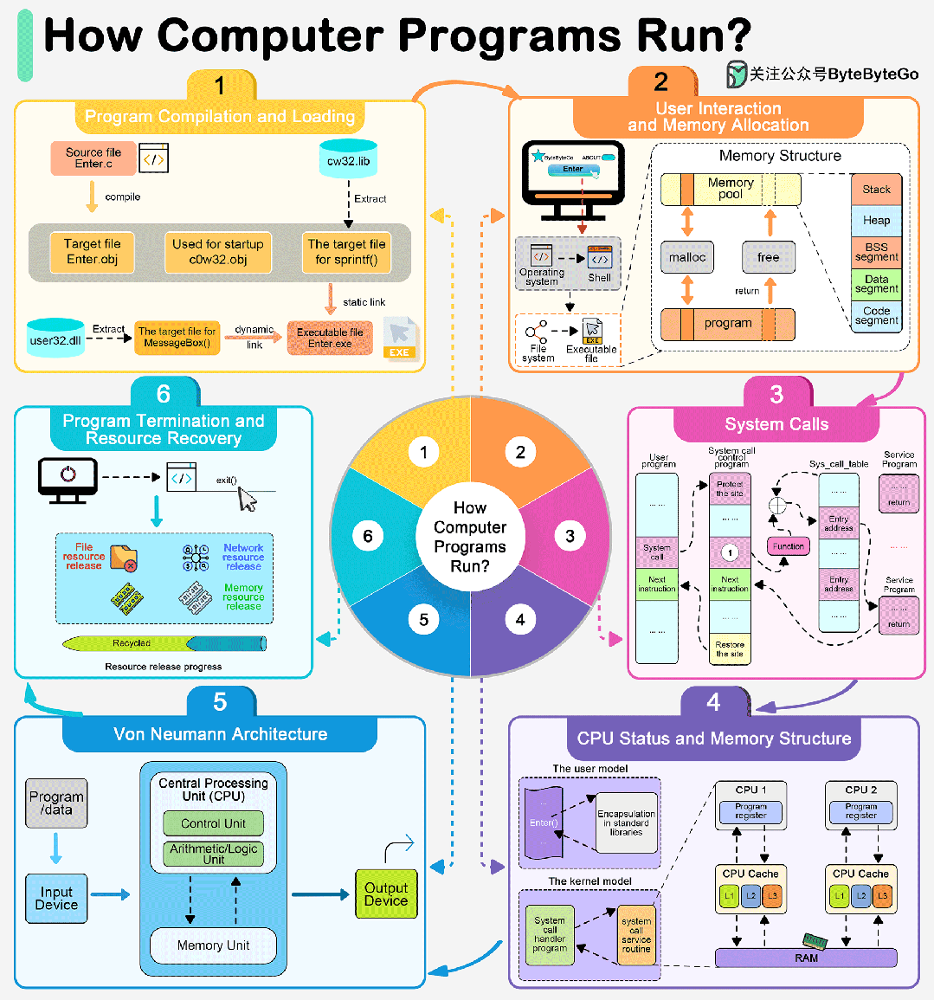

tags:: c, 内存分配，堆，栈

- 
- **bss段（bss segment）**通常是指用来存放程序中**未初始化或初始化为0的全局变量**的一块内存区域，属于静态内存分配。
	- Block Started by Symbol
- **数据段（data segment）**通常是指用来存放程序中**已初始化非0的全局变量**的一块内存区域，属于静态内存分配。
- **代码段（code segment/text segment）**通常是指用来存放**程序执行代码**的一块内存区域。这部分区域的大小在程序运行前就已经确定，并且内存区域通常属于只读（某些架构也允许代码段为可写，即允许修改程序）。
	- 在代码段中，也有可能包含一些只读的常数变量，例如字符串常量等。
- **堆**是用于存放进程运行中**被动态分配的内存段**，它的大小并不固定，可动态扩张或缩减。当进程调用malloc等函数分配内存时，新分配的内存就被动态添加到堆上（堆被扩张）；当利用free等函数释放内存时，被释放的内存从堆中被剔除（堆被缩减）。
- **栈**又称堆栈，是用户存放程序**临时创建的局部变量**，也就是说我们函数括弧“{}”中定义的变量（但不包括static声明的变量，static意味着在数据段中存放变量）。
	- 除此以外，在函数被调用时，其参数也会被压入发起调用的进程栈中，并且待到调用结束后，函数的返回值也会被存放回栈中。
	- 由于栈的后进先出（LIFO）特点，所以栈特别方便用来保存/恢复调用现场。从这个意义上讲，我们可以把堆栈看成一个寄存、交换临时数据的内存区。
- **一个程序本质上都是由 bss段、data段、text段三个组成的。**
- 包含data段和bss段的整个区段此时通常称为数据区。
-
- [C/C++内存管理详解 | ShinChan's Blog (chenqx.github.io)](https://chenqx.github.io/2014/09/25/Cpp-Memory-Management/)
	- ```c++
	  void f() 
	  { 
	    int* p=new int[5]; 
	  }
	  ```
	- 在栈内存中存放了一个指向一块堆内存的指针`p`。在程序会先确定在堆中分配内存的大小，然后调用`operator new`分配内存，然后返回这块内存的首地址，放入栈中